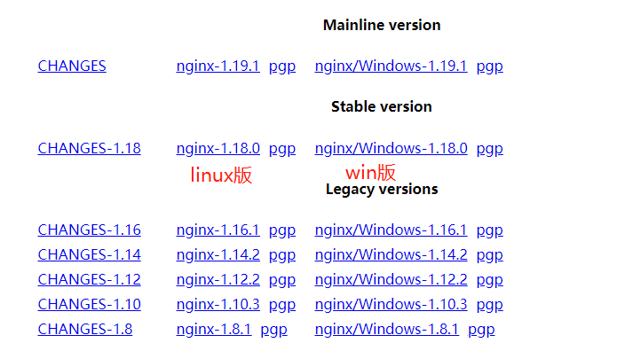
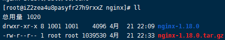
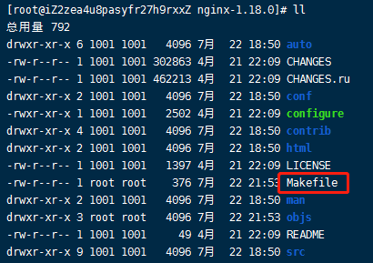
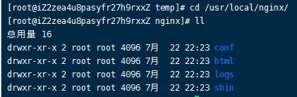
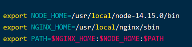

# 002-nginx的安装

nginx是C语言开发的，安装ngixn需要经过c编译再安装

## 1、安装依赖
* `gcc-c++`: 编译C语言用到
* `pcre`: 一个Perl库，包括perl兼容的正则表达式库。nginx的http模块使用pcre来解析正则表达式
* `zlib`: nginx使用zlib对http包的内容进行gzip，所以需要在linux上安装zlib库
* `openssl`: nginx不仅支持http协议，还支持https（即在 ssl 协议上传输 http），所以需要在linux安装openssl库。
 
```shell
yum install -y gcc-c++

yum install -y pcre pcre-devel

yum install -y zlib zlib-devel

yum install -y openssl openssl-devel
```


## 2、下载对应版本
从[官网](http://nginx.org/en/download.html)下载对应版本




## 3.上传到服务器
上传到`/usr/local/temp/nginx-temp`里面，执行解压命令`tar -zxvf nginx-1.18.0.tar.gz`

解压后的路径`/usr/local/temp/nginx-temp/nginx-1.18.0`




## 4、安装nginx
1. 进入解压后的目录，执行configure
```shell
cd nginx-1.18.0

./configure  # 执行configure命令，执行完会生成Makefile
```


> 执行configure的时候，可以带参数
```shell
./configure \
--prefix=/usr \                              # 指向安装目录
--sbin-path=/usr/sbin/nginx \                # 指向（执行）程序文件（nginx）
--conf-path=/etc/nginx/nginx.conf \          # 指向配置文件
--error-log-path=/var/log/nginx/error.log \  # 指向log
--http-log-path=/var/log/nginx/access.log \  # 指向http-log
--pid-path=/var/run/nginx/nginx.pid \        # 指向pid
--lock-path=/var/lock/nginx.lock \           # （安装文件锁定，防止安装文件被别人利用，或自己误操作。）
--user=nginx \
--group=nginx \
--with-http_ssl_module \                     # 启用ngx_http_ssl_module支持（使支持https请求，需已安装openssl）
--with-http_flv_module \                     # 启用ngx_http_flv_module支持（提供寻求内存使用基于时间的偏移量文件）
--with-http_stub_status_module \             # 启用ngx_http_stub_status_module支持（获取nginx自上次启动后到现在为止的工作状态）
--with-http_gzip_static_module \             # 启用ngx_http_gzip_static_module支持（在线实时压缩输出数据流）
--http-client-body-temp-path=/var/tmp/nginx/client/ \   # 设定http客户端请求临时文件路径
--http-proxy-temp-path=/var/tmp/nginx/proxy/ \          # 设定http代理临时文件路径
--http-fastcgi-temp-path=/var/tmp/nginx/fcgi/ \         # 设定http fastcgi临时文件路径
--http-uwsgi-temp-path=/var/tmp/nginx/uwsgi \           # 设定http uwsgi临时文件路径
--http-scgi-temp-path=/var/tmp/nginx/scgi \             # 设定http scgi临时文件路径
--with-pcre # 启用pcre库
```

2. 执行编译安装
```shell
make  # 编译
make install  # 安装
```

nginx默认安装在`/usr/local/nginx/`这里，进入该目录




3. 启动nginx
```shell
./nginx            # 启动nginx

ps aux|grep nginx  # 查看进程

./nginx -s stop    # 停止nginx
```
启动nginx后，就可以通过浏览器访问`http://59.110.21.75/`


#### 5. 配置命令到环境变量
通过上面的方式配置的nginx，每次需要进入到`/usr/local/nginx/sbin` 才能执行nginx命令，如果觉得麻烦，可以把nginx命令配置到环境变量里面，这样在任何目录都可以自行

```shell
vim /etc/profile
```

在最后面添加
```
export NGINX_HOME=/usr/local/nginx/sbin
export PATH=$NGINX_HOME:$PATH
```



> 截图里面是因为以前自己还配置过node的环境变量

然后重启
```
source /etc/profile
```


这样就可以随时执行nginx命令了
```shell
nginx -v  # 小写v 查看nginx版本
nginx -V  # 大写V 查看当初安装nginx的命令
```