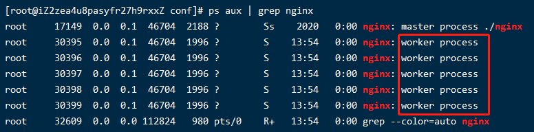
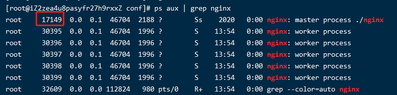
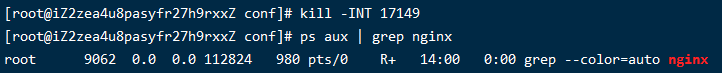
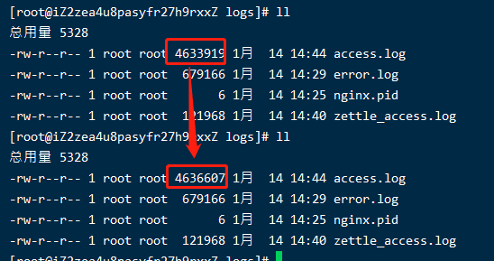
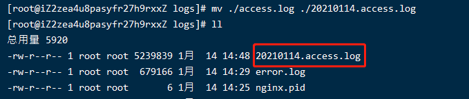
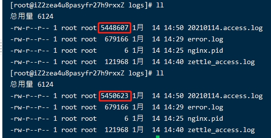
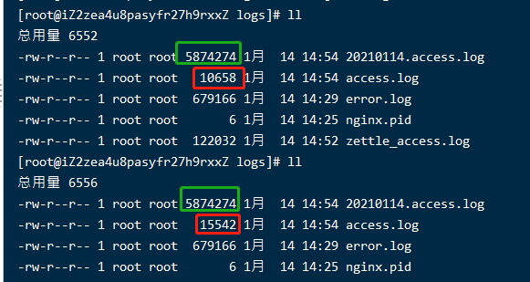

# 004-nginx的信号量

nginx的信号量，是指和kill搭配的命令，nginx支持下面几种信号量

|     参数     | 含义  |
| ----------- | ----  |
|   term/int  | 硬关闭 |
|     quit    | 软停止，处理完当前没有处理完的请求再关闭 |
|     hup     | 等到没有请求的时候，再读取nginx配置然后重启 |
|     usr1    | 重读日志，在日志切割有用 |
|     usr2    | 平滑的升级 |
|     winch   | 优雅的关闭旧的进程，配合usr2来进行升级 |

## 1、查看nginx进程
```shell
ps aux | grep nginx # 看出nginx的进程
```
执行完后，可以看到下面的结果：


上面中分别看到3条进程

> nginx的这么工作的，master进程负责管理work进程，真正在处理请求的是work进程

我们修改`nginx.conf`里面的`work_process`
```nginx
worker_processes 5;
```
然后重启nginx，再执行 `ps aux | grep nginx` 可以看到，这次就有5个work进程了




## 2、term/int
硬停止即让nginx不管什么情况，立即停止掉

查看nginx的主进程，然后直接通过kill掉进程
```shell
ps aux | grep nginx # 查看进程
kill -INT 进程 # 删掉指定进程
```

执行 `ps aux | grep nginx` 的到下面结果，看出主进程是`17149`


接着执行`kill -INT 17149`，再执行看进程已经不在了



> 后面为了方面，统一用17149来表示nginx主进程

## 3、quit
执行 `kill -quit 17149` 

nginx是这么工作的，把当前处理到一半的事情处理完，然后再关闭进程


## 4、hup
执行 `kill -hup 17149`

nginx是这么工作的，把当前处理到一半的事情处理完，然后重新读取`nginx.conf`配置，并重启


## 5、usr1
执行 `kill -usr1 17149`

nginx会优雅的读取新的日志节点然后重启，常常用在日志切割

> 首先我们要知道linux和window对文件名的管理不一样，linux更多的依赖文件的inode来找到文件的

**模拟日志切割**
1. 首先在 `http://bbb.com` 上写个js脚本，让其一直处于刷新状态，这样子就模拟一直有客户端请求nginx，nginx的访问日志一直在累加

```html
<h1>这是bbb页面</h1>
<script>window.location.reload()</script>
```

2. 访问 `http://bbb.com` 一直处于刷新状态，查看nginx的
`log/access.log`日志，可以看到日志一直再增加
```shell
ll
```



3. 现在模拟到了0点要日志切割了，我们通过命令
```shell
mv ./access.log ./20210114.access.log # 把原来的日志重命名
``` 


已经把旧的日志归档到了，多次执行 `ll` 会发现nginx的日志还是继续往`20210114.access.log`这个上面加，而不是重新生成`access.log`



> 这个就是linux上的文件特点，和window不同，linux不依赖文件名去识别文件，而是依赖文件的inode


4. 执行`kill -usr1`
执行下面命令
```shell
kill -usr1 17149
```
nginx会重新生成access_log然后往这个新的上面追加日志

通过多次`ll`可以看到，新的访问日志记录是追加到`access.log`上面了




