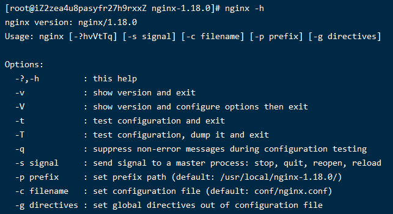

# 005-nginx的命令

通过 `nginx -h` 可以查看支持的命令

## 1、`nginx -s`命令

nginx自带命令，实现的效果和前面讲的[信号量](./004-nginx的信号量.md)作用一样

* `nginx -s stop`: 等同于`kill -int`
* `nginx -s quit`: 等同于`kill -quit`
* `nginx -s reopen`: 等同于`kill -usr1`
* `nginx -s reload`: 等同于`kill -hup`

## 2、`nginx -t`命令
检查 `nginx.conf` 配置是否正确

## 3、`nginx -v`命令
查看nginx的版本号

## 4、`nginx -V`命令
查看nginx的版本号以及当初编译执行`configure`的时候所带的参数