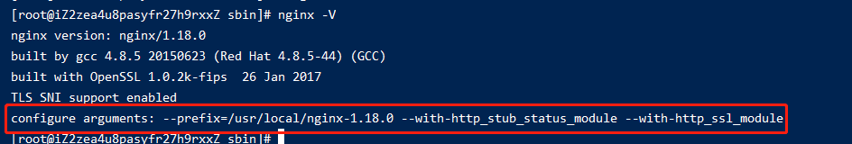
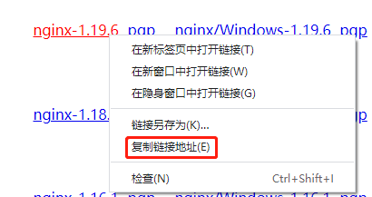
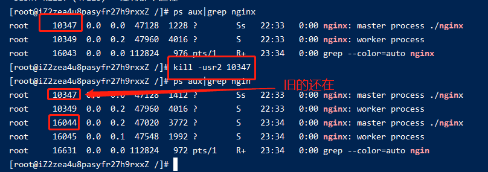
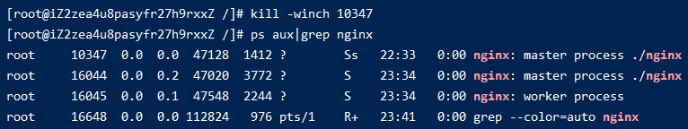

# 006-nginx的优雅升级

现有nginx是在`/usr/local/nginx-1.18.0`，版本为`1.18.0`。

已经在线上跑了一段时间，现在准备将其升级到`1.19.6`

1. 升级nginx其实就是升级`bin/nginx`这个二进制文件，为了防止出错，先将该二进制文件备份下
```shell
cd /usr/local/nginx-1.18.0/sbin
cp ./nginx ./nginx.bak
```

2. 查看下以前安装nginx执行过的参数
```shell
nginx -V
```


一定要记住这个参数，最好找个地方记下

3. 下载 `nginx 1.19.6`



```shell
# 下载
wget http://nginx.org/download/nginx-1.19.6.tar.gz

# 解压
tar -zxvf nginx-1.19.6.tar.gz
```

4. 配置
把之前查看到的参数配置拿过来执行下
```shell
cd nginx-1.19.6

# 配置
./configure --prefix=/usr/local/nginx-1.18.0 --with-http_stub_status_module --with-http_ssl_module

# 编译
make
```
执行完`make`后，会在`nginx-1.19.6/objs`里面生成一个二进制文件`nginx`，把这个`nginx`替换原来运行的nginx二进制
```shell
cd nginx-1.19.6/objs

# -f 强制复制
cp ./nginx /usr/local/nginx/sbin/nginx -f 
```

5. 执行
```shell
# 查看进程
ps aux|grep nginx

kill -usr2 10347
```


可以看到执行完后，会启动一批新的进程来执行master和work进程，旧的master和work进程依旧还在

执行
```shell
kill -winch 10347
```


就可以看到旧的word进程已经都没有，仅留一个旧的master进程在，这个是为了反正出问题，可以给我们回退的

如果确定没有问题了，就可以执行命令把旧的进程删掉
```shell
kill 10347
```