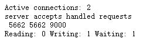

# 008-nginx状态


## 1.启动状态
nginx里面有一个模块 `ngx_http_stub_status_module`，这个模块记录着nginx基本访问状态。要想使用这个模块，在安装的时候需要带上参数`--with-http_stub_status_module`

对于已安装的，可以通过`nginx -V`来看下是否有安装好该模块了

当安装好该模块，我们可以在server里面开启
```nginx
server {
    listen       80;
    server_name  aaa.com;
    location / {
        stub_status on;
        root   /root/svr/aaa;
        index  index.html index.htm;
    }
}
```
当访问 `http://aaa.com` 的时候，页面不在展示我们指定目录的前端代码了，而是直接展示下面截图




## 2.解析
```
Active connections: 2 
server accepts handled requests
 5664 5664 9028 
Reading: 0 Writing: 1 Waiting: 1 
```
上面几个的意思:

* 第1行: `Active connections: 2` 表示nginx正处理的活动连接数2个

* 第2-3行: `server accepts handled requests 5664 5664 9028` 

    * 第1个server表示nginx启动到现在一共处理了5664个链接
    * 第2个accepts表示nginx启动到现在共成功创建5664次握手（请求丢失数=握手数-上面的server的链接数），两者相减为0表示到目前没有丢失请求
    * 第3个handled requests，表示共处理了9028次请求，

* 第4行: `Reading: 0 Writing: 1 Waiting: 1`
    * 第1个Reading表示nginx读取到客户端的header信息数
    * 第2个Writing表示nginx放回客户端的header信息数
    * 第3个Waiting表示nginx已经处理完正在等候下一次请求指定的驻留连接，开启keep-alive的情况下，这个值等于`active - ( reading + writing )`
