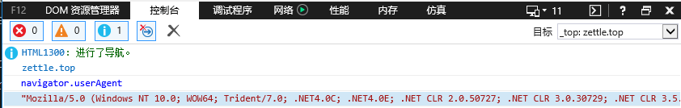
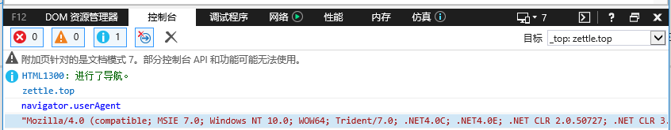
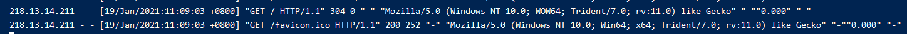

# 013-nginx重写


## 1、常用重写命令
```nginx
if (条件) {} # 设定条件，再进行重写
set # 设置变量
return # 返回状态码
break # 跳出rewrite
rewrite # 重写
``` 


## 2、if判断
格式:
```nginx
if (条件) {  # 注意if后面的空格不能省
    重写模式
}
```

条件支持下面几种写法:
* `=`: 判断是否相等，用于字符串比较
* `~`: 用正则匹配，区分大小写
* `~|~*`: 用正则匹配，不区分大小写
* `-f`: 来判断是否为文件
* `-d`: 来判断是否为目录
* `-e`: 来判断是否存在


### 2.1 场景1：禁止某些IP访问

比如现在访问 `http://aaa.com` 访问了项目A的前端代码
```nginx
server {
    listen       80;
    server_name  aaa.com;
    location / {
        root /root/svr/aaa;
        index index.html index.htm;
    }
}
```

我们现在加个判断，如果是指定IP的，就不给访问了
```nginx
server {
    listen       80;
    server_name  aaa.com;
    location / {
        # 如果客户端IP=218.13.14.211就返回403状态码
        # 客户端IP可以去 log/access.log 中访问日志看
        if ($remote_addr = 218.13.14.211) {
            return 403;
        }
        root /root/svr/aaa;
        index index.html index.htm;
    }
}
```


### 2.2 场景2： 用IE浏览器访问提示升级
比如现在访问 `http://aaa.com` 访问了项目A的前端代码
```nginx
server {
    listen       80;
    server_name  aaa.com;
    location / {
        root /root/svr/aaa;
        index index.html index.htm;
    }
}
```

我们想要实现这种效果：用户用IE浏览器访问的时候，就出现我们的提示升级页面
```nginx
server {
    listen       80;
    server_name  aaa.com;
    location / {
        # 网上很多写的是 $http_user_agent ~ MISE
        if ($http_user_agent ~ Trident) { 
            rewrite ^.*$ /ie.html;
            break; # 这里不能省略
        }
        root /root/svr/aaa;
        index index.html index.htm;
    }
}
```
1. 网上很多写的是 `$http_user_agent ~ MISE`。因为测试的时候，电脑已经是IE11，IE11不再有MISE的ua，就算是在IE11上切换成低版本的，也不会影响nginx获取到的ua

IE原来的UA



切换成IE7后，用JS获取的UA



但是在nginx中获取的UA



可以看出来，就算是IE切换了版本，获取的还是原来的UA

2. `break`不能省
记住`break`不能省，否则会死循环，去掉后，用IE访问出现500错误

去 `log/error.log` 里面看日志，可以发现是死循环了: `rewrite or internal redirection cycle while processing "/ie.html", client: 218.13.14.211, server: aaa.com, request: "GET / HTTP/1.1", host: "aaa.com"`


这是因为不加`break`后，nginx匹配进入然后出发rewrite，接着内部uri跳转请求`/ie.html`，这个时候又匹配中了

3. 按照上面配置，`ie.html`的位置应该在 `/root/svr/aaa/ie.html` 这里


### 2.3 场景3： 找不到返回特定页面
访问 `http://aaa.com`，访问 `http://aaaa.com/aa.html`并不存在返回我们指定的页面，当然我们也可以用`error_page`配置，不过这里专门演示下`-e`的用法。

```nginx
location / {
    if (!-e $document_root$fastcgi_script_name) {
        rewrite ^.*$ /nofind.html;
        break;
    }
    root /root/svr/aaa;
    index index.html index.htm;
}
```

1. `$document_root$fastcgi_script_name`表示访问的是linux的哪个文件夹，比如访问`http://aaaa.com/aa.html`，则`$document_root$fastcgi_script_name = /root/svr/aaa/aa.html`

2. `break`必须加上，不然会进入循环


## 3、set 设置变量
```nginx
if ($http_user_agent ~* mise) {
    set $isIE 1; # 如果ua中含有mise就设置$isIE=1
}
if ($fastcgi_script_name = ie.html) {
    set $isIE 0; # 如果访问的是ie.html就设置$isIE=0
}
if ($isIE = 1) {
    rewrite ^.*% ie.html; # 如果$isIE就rewrite到ie.html
}
```
上面的等同`break`
```nginx
if ($fastcgi_script_name = ie.html) {
    rewrite ^.*% ie.html;
    break;
}
```
