# 019-nginx升级https


[参考资料](https://www.cnblogs.com/tomingto/p/11327696.html)

## 1. 选购证书

这里从[阿里云-SSL证书](https://www.aliyun.com/product/cas?spm=5176.10695662.1171680.1.7cd6720fAyy1m4)上选购个免费的证书

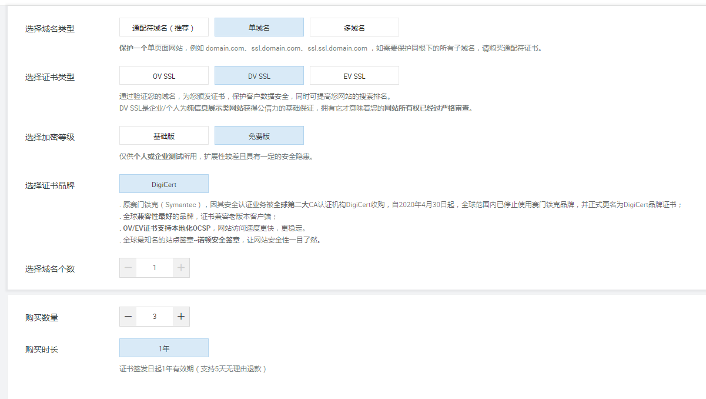

> 推荐购买上面的通配符域名，比如买了后，那么所有的二级域名都可以享受https服务

购买后就可以去阿里云的证书控制台进行证书申请

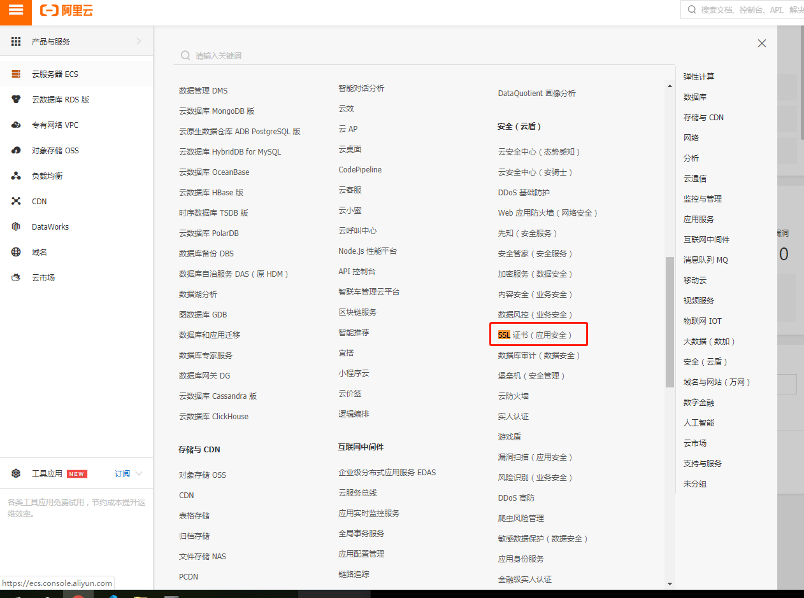

在控制台可以看到购买的证书，点击进行申请

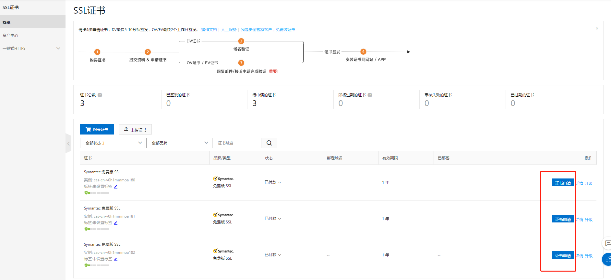

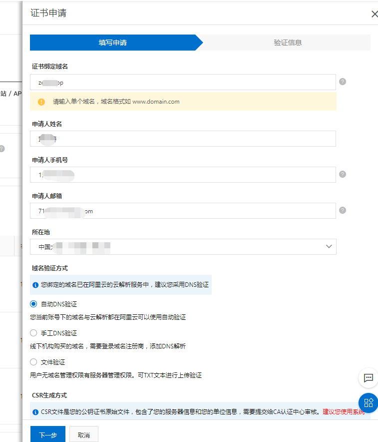


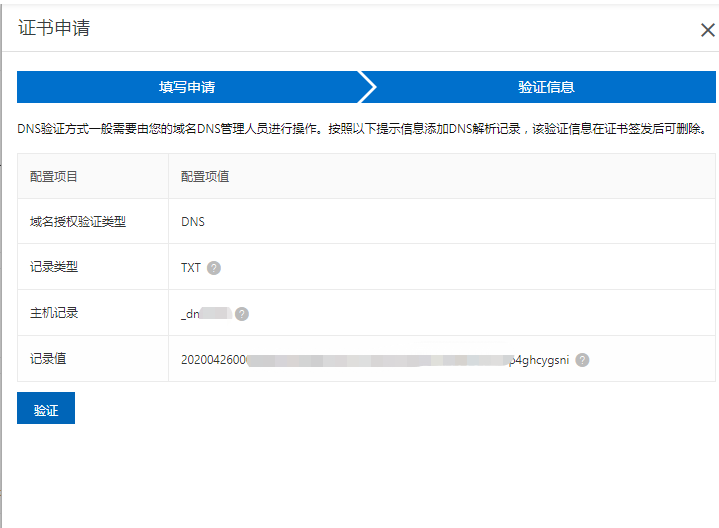

等待审核通过

审核通过后，就可以下载证书

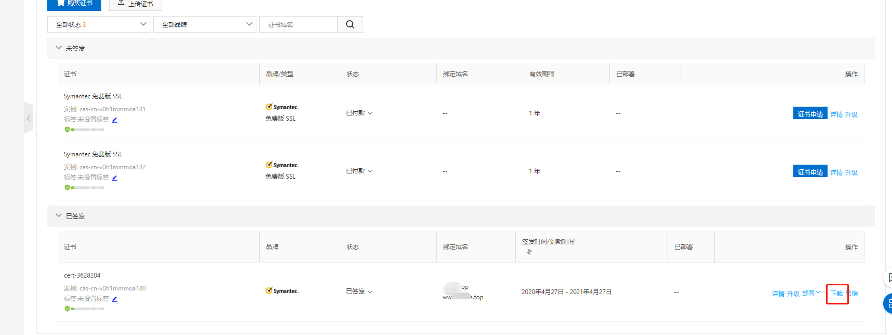

根据自己服务器选择版本下载，我们用的是nginx

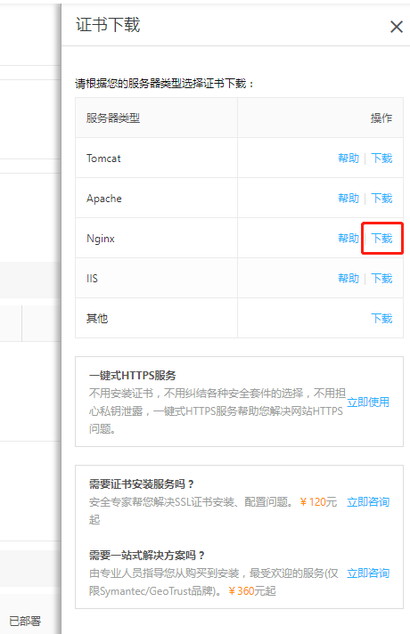

下载完解压后可以看到是2个文件

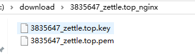


## 2. 安装证书

[nginx安装https教程](https://help.aliyun.com/document_detail/98728.html?spm=5176.2020520163.cas.29.44ed56a7izZsxX)

默认下，nginx的安装目录是`/usr/local/nginx`。配置文件位置在`/usr/local/nginx/conf`。

在`/usr/local/nginx/conf`新建`cert`文件夹，并把解压的2个文件放进去

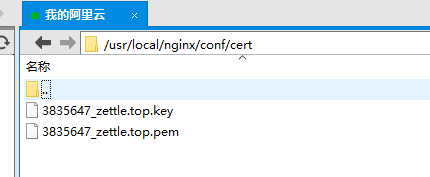

修改nginx的配置文件
```cmd
server {
    listen       443 ssl; #SSL协议访问端口号为443。此处如未添加ssl，可能会造成Nginx无法启动
    server_name  localhost; #将localhost修改为您证书绑定的域名，例如：www.example.com

    ssl_certificate      cert/3835647_zettle.top.pem; #将domain name.pem替换成您证书的文件名。
    ssl_certificate_key  cert/3835647_zettle.top.key; #将domain name.key替换成您证书的密钥文件名

    ssl_session_cache    shared:SSL:1m;
    ssl_session_timeout  5m;

    ssl_ciphers ECDHE-RSA-AES128-GCM-SHA256:ECDHE:ECDH:AES:HIGH:!NULL:!aNULL:!MD5:!ADH:!RC4;  #使用此加密套件。
    ssl_protocols TLSv1 TLSv1.1 TLSv1.2;   #使用该协议进行配置。
    ssl_prefer_server_ciphers  on;

    location / {
        root   /root/web/yui;
        index  index.html index.htm;
    }
}
```

### 2.1 错误1
执行检查`nginx -t`。提示`nginx: [emerg] the "ssl" parameter requires ngx_http_ssl_module in /usr/local/nginx/conf/nginx.conf:114
`

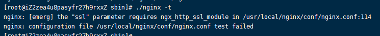

这是nginx之前安装的时候没有开启ssl功能，查看是否开启命令`nginx -V`

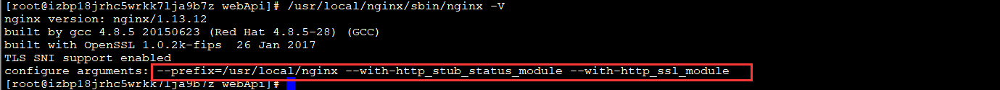

看不到红框的说明是没有安装过

回到原先安装nginx从网上下载好解压的目录。如果已经删除掉可以重新下载对应版本，查看nginx版本命令`nginx -V`

* 原nginx解压路径：`/root/nginx-1.16.1`
* 服务器nginx路径：`/usr/local/nginx`

首先进到原nginx路径`/root/nginx-1.16.1`里面，执行命令
```
./configure --prefix=/usr/local/nginx --with-http_stub_status_module --with-http_ssl_module

make
```

备份好以前安装好的nginx：
```cmd
cp /usr/local/nginx/sbin/nginx /usr/local/nginx/sbin/nginx.bak
```

把刚才编译好的nginx覆盖现有的，如果nginx启动着需要先停止，停止命令。
```
nginx -s stop

cp /root/nginx-1.16.1/objs/nginx /usr/local/nginx/sbin/

cd /usr/local/nginx/sbin

./nginx #启动
```
现在再看`./nginx -V`就能看到ssl信息了


启动完成就可以进行https访问了，如果浏览器一直请求不通，可能防火墙或者网络安全策略没开。阿里云的前往服务器安全组开下


## 3、把http都转为https上去
配置下nginx
```
server {
    listen       80;
    server_name  localhost;
    rewrite ^(.*)$ https://$host$1 permanent;   #将所有http请求通过rewrite重定向到https。
}
```