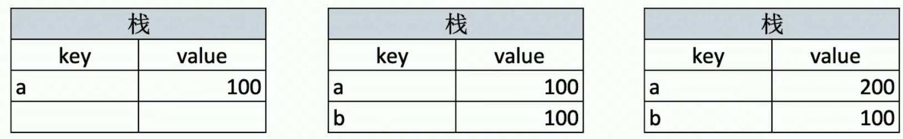
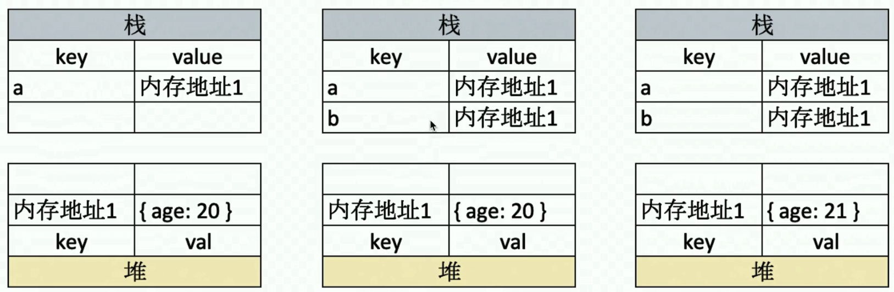

# 001-基础-值类型和引用类型

## 1、值类型和引用类型的区别
```js
// 值类型，不相互影响
let a = 100;
let b = a;
a = 200;
console.log(b); // 100 

// 引用类型，相互影响
let a = {age:100};
let b = a;
a.age = 200;
console.log(b.age); // 200
```
为什么会出现值类型和引用类型赋值的区别呢？

这个要明白计算机是怎么存储变量的，存储的有栈内存和堆内存。


## 2、值类型的赋值过程
对于上面代码，计算机是这么存储的



对于值类型，每次赋值都是把值赋值过去，所以操作a的时候，a和b没有什么影响


## 2、引用类型的赋值过程
对于上面的引用类型代码，计算机是这么存储的



可以看出，变量a和变量b真正赋值的是堆内存的内存地址，操作的时候也是通过内存地址操作，所以一旦操作哪里一个，另一个也是发生改变


## 3、为什么要这么设计
所有的语言，都是这么设计引用类型和值类型，那么是为什么呢？

这是为了性能，加入引用类型和值类型一样，都是在栈内存赋值，那么一旦遇到一个超级大的json，并且赋值给其他的时候就十分消耗内存

 