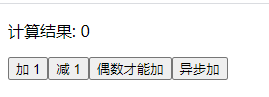

# 001-redux介绍

redux不是react官方推出的，不一定和react绑定使用，也可以和vue/angular使用

## 1、一个最简单的demo



如果用普通的react实现，代码如下:
```jsx
export default class App extends Component {
    state = {
        num: 0
    };
    // +1
    add () {
        this.setState({
            num: this.state.num + 1
        });
    }
    // -1
    subt () {
        this.setState({
            num: this.state.num - 1
        });
    }
    // 偶数+1
    addifeven () {
        if (this.state.num % 2 === 0) {
            this.setState({
                num: this.state.num + 1
            });
        }
    }
    // 异步+1
    addAsync () {
        setTimeout(() => {
            this.setState({
                num: this.state.num + 1
            });
        }, 1000);
    }
    render() {
        return (
            <div>
                <p>计算结果: {this.state.num}</p>
                <button onClick={() => this.add()}>加 1</button>
                <button onClick={() => this.subt()}>减 1</button>
                <button onClick={() => this.addifeven()}>偶数才能加</button>
                <button onClick={() => this.addAsync()}>异步加</button>
            </div>
        )
    }
};
```

改造成redux

1. 新建`/src/redux/store.js` 和 `/src/redux/count_reducer.js`
* store全局只有一个，所以就一个`store.js`
* reducer有多个，所以从文件名上就要区分是哪个

定义reducer
```js
`/src/redux/count_reducer.js` 内容
/*******************************
 * reducer的作用: 初始化数据（页面一打开的时候） + 更新数据
 *
 * redux初始化数据
 *      preState=undefined
 *      action={type:'@@redux/INIT随机字符串'}
 *
 * redux更新数据
 *      preState=当前state数据
 *      action={type:派发来的事件, data:派发来的数据}
 ******************************/
const initState = 0; // 初始化值
export default function countReducer(preState = initState, action) {
    const {type, data} = action;
    switch (type) {
        case 'add-action': // 加
            return preState + data;
        case 'jian-action': // 减
            return preState - data;
        default: // 没有action匹配上，说明是redux初始化，把默认数据返回进行初始化
            return initState;
    }
}
```

定义store
```js
// `/src/redux/store.js` 内容
import {createStore} from 'redux';
import countReducer from './count_reducer'

export default createStore(countReducer); // 暴露store
```

2. 修改页面代码

```js
import React, { Component } from 'react';
import store from './redux/store';
export default class App extends Component {
    componentDidMount() {
        // 监听redux数据改变
        store.subscribe(() => {
            this.setState({}); // 重新出发render
        });
    }
    add () {
        store.dispatch({ type: 'add-action', data: 1 });
    }
    jian () {
        store.dispatch({ type: 'jian-action', data: 1 });
    }
    addifeven () {
        if (store.getState() % 2 === 0) {
            store.dispatch({ type: 'add-action', data: 1 });
        }
    }
    addAsync () {
        setTimeout(() => {
            store.dispatch({ type: 'add-action', data: 1 });
        }, 1000);
    }
    render() {
        return (
            <div>
                <p>计算结果: {store.getState()}</p>
                <button onClick={() => this.add()}>加 1</button>
                <button onClick={() => this.jian()}>减 1</button>
                <button onClick={() => this.addifeven()}>偶数才能加</button>
                <button onClick={() => this.addAsync()}>异步加</button>
            </div>
        )
    }
};
```

* `store.getState()`: 获取store里面的数据，每次要store数据就调用一次
* `store.dispatch(action)`: 触发reducer
* `store.subscribe()`: 监听store数据的改变
* `this.setState({})`: 触发react的`render()`

> redux不是为react或者vue设计的，所以redux没有响应式数据，修改后不会自动更新react里面的数据，需要开发者自己每次需要获取数据的时候，就调用`store.getState()`去获取


## 2、action

在上面的例子总，我们是自己定义一个json格式 `{ type: 'add-action', data: 1 }` 作为action，并且多个地方写死字符串`add-action`不好维护

而真正项目中，action应该是由函数创建好，并且actionName应该放在一个js中统一维护

新建`/src/redux/constant.js` 用于维护actionName常量名称

新建`/src/redux/count_action.js` 用于创建action对象

```js
// constant.js 内容
export const addActionName = 'add-action';
export const jianActionName = 'jian-action';
```

编写`count_action.js`
```js
// count_action.js 内容
// 定义创建action的函数
import {addActionName, jianActionName} from './constant'
export const createAddAction = (data) => {
    return {type: addActionName, data};
};

export const createJianAction = (data) => {
    return {type: jianActionName, data};
};
```

这样，页面上调用`store.dispatch({type: 'add-action', data: 1})`的就需要对应的改为`store.dispatch(createAddAction(1))`

同时，reducer里面写死的actionName应该改为引入常量js
```js
switch(type) {
    // case 'add-action'
    case addActionName:
        return preState + data;
    case jianActionName:
        return preState - data;
    default:
        return preState;
}
```


## 3、异步action

在redux，我们用`{type: <actionName>, data: <data>}` 定义一个action，这种属于同步action

默认情况下，redux不支持异步action，需要再使用一个第3方库`redux-thunk`，引入后，就可以定义异步action

* 异步action是一个函数，比如`store.dispatch(() => {})`
* 同步action是一个json格式，比如`store.dispatch({type: <actionName>, data: <data>})`


1. 通过`npm i redux-thunk`后，修改`/src/redux/store.js`的内容

```js
import {createStore, applyMiddleware} from 'redux'
import thunk from 'redux-thunk'
import countReducer from './count_reducer';
// 多了个redux-thunk中间件，需要用applyMiddleware()
export default createStore(countReducer, applyMiddleware(thunk));
```


2. 就可以用异步action了

```js
// 异步加
addAsync () {
    setTimeout(() => {
        store.dispatch({ type: 'add-action', data: 1 });
    }, 1000);
}
```
改为
```js
addAsync () {
    // 派发异步action
    store.dispatch((dispatch) => {
        setTimeout(() => dispatch(createAddAction(1)), 500);
    });
}
```

进一步，异步action也应该和同步action一样，定义到`/src/redux/count_action.js`里面
```js
// src/redux/count_action.js
export const createAddAsyncAction = (data, deploy) => {
    return (dispatch) => {
        setTimeout(() => dispatch(createAddAction(1)), deploy);
    };
}
```
这样，页面就改为派发这个`createAddAsyncAction()`
```jsx
// App.jsx
addAsync () {
    store.dispatch(createAddAsyncAction(1, 500));
}
```
