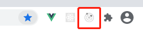
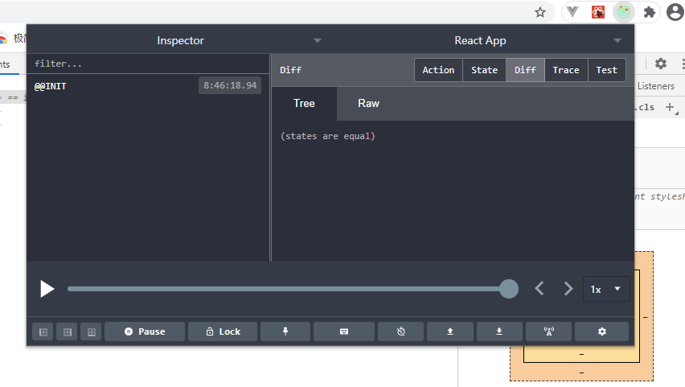

# 003-redux的chrome扩展

redux也有chrome扩展插件可以将数据可视化

1. 安装[Redux-DevTools](https://chrome.zzzmh.cn/info?token=lmhkpmbekcpmknklioeibfkpmmfibljd)

安装后，chrome多了个redux的图标



当我们启动redux后，这个图标依旧是灰色的。

是因为这个插件需要我们在代码里面配合改动


2. 项目引入redux-devtools-extension

安装: `npm i -D redux-devtools-extension`

引入，修改我们创建store的地方
```js
// 修改`/src/redux/store.js`

import {createStore, applyMiddleware} from 'redux';
import thunk from 'redux-thunk';
import {composeWithDevTools} from 'redux-devtools-extension';
import reducers from './reducers';

// 用composeWithDevTools在包裹一层，然后传递给第2个参数
export default createStore(reducers, composeWithDevTools(applyMiddleware(thunk)));
```


3. 再启动项目

可以看到再启动项目后，能看到图标亮了

