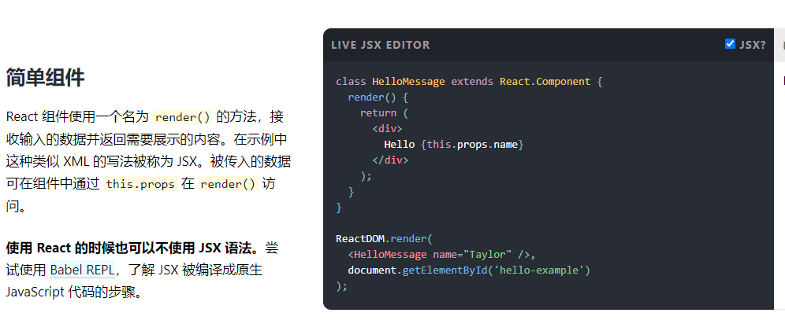
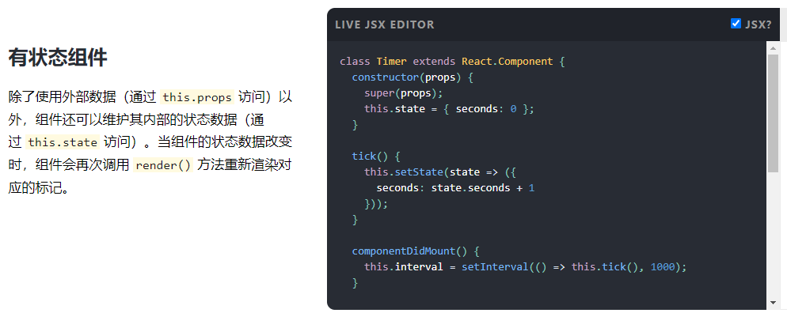

# 001-几种组件类型


## 1、函数组件
用函数的形式声明组件
```jsx
function App () {
  return <h1>Hello</h1>
}
ReactDOM.render(<App />, document.getElementById('root'));
```


## 2、类组件
用class的形式声明组件

```jsx
class App extends React.Component {
  render () {
    return <h1>Hello</h1>
  }
};
ReactDOM.render(<App />, document.getElementById('root'));
```


## 3、简单组件
无state状态的组件
```jsx
class App extends React.Component {
  render () {
    return <h1>Hello</h1>
  }
};
```


## 4、复杂组件
有state状态的组件
```jsx
class App extends React.Component {
  constructor(props) {
    super(props);
    this.state = { seconds: 0 }; // 有设置state
  }
  render () {
    return <h1>Hello</h1>
  }
};
```



> 简单组件、复杂组件是针对类组件的，因为只有类组件才有实例，才有this，才有state这个属性，state为空的是简单组件，state有值的是复杂组件，而函数组件连state属性都没有

> 简单组件、复杂组件的定义可以看[官网](https://reactjs.bootcss.com/)