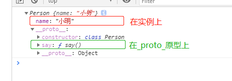
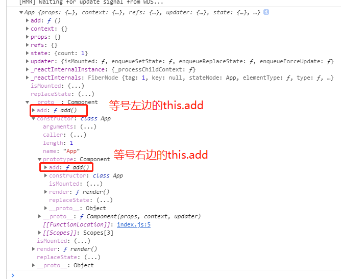

# 003-深入理解事件绑定的this问题


## 1、问题
[视频](https://www.bilibili.com/video/BV1wy4y1D7JT?p=15)

首先来看一个最简单经典的代码
```jsx
class App extends React.Component {
  constructor (props) {
    super(props);
    this.state = {
      count: 1
    };
  }
  add () {
    console.log(this); // 这里的this=undefined
  }
  render () {
    return <button type="button" onClick={this.add}>累加:{this.state.count}</button>
  }
};
```
我们都知道，通过这种方式调用的，`add()`方法里面的`this=undefined`，那么为什么是undefined呢


## 2、解析问题
要明白这个事件，需要从class类入手
```js
class Person {
    constructor (name) {
        this.name = name; // 放在实例上
    }
    say () { // 放在Person这个原型对象上
        console.log(this);
    }
}
const p1 = new Person('小明');
console.log(p1);
p1.say();
```


当执行`p1.say()`的时候，`say()`里面的this就是指向p1这个实例

假如改成下面的代码
```js
const p1 = new Person('小明');
const xx = p1.say; // 先赋值给一个变量
xx(); // 再通过变量调用，那么这个时候 `say()` 里面的this就是undefined了
```

这个就是class的特点了，只有通过实例调用的，即上面的`p1.say()` 。方法里面的this才会指向实例

而第2中情况，是把方法赋值给了一个变量，然后再调用该变量`xx()`，这种是函数的直接调用。

而js基础知道，函数的直接调用，里面的this应该为window的。

```js
function yy () {
    console.log(this); // 函数直接调用，this=window
}
yy();
```

然而在上面的例子，我们看到的`this=underfined`。这又是为什么呢？

这是class类的另外一个特性，class类会将其定义的所有方法，都默认内部开启严格模式，所以[this不敢指向全局对象](https://www.cnblogs.com/mengfangui/archive/2017/12/02/7954585.html)，只能指向undefined
```js
function yy () {
	'use strict'
    console.log(this); // 因为开启了严格模式，所以这个this=underfined
}
yy();
```

最后，我们回到react代码
```jsx
<button type="button" onClick={this.add}></button>
```
中`onClick={this.add}`是发生了什么事

首先`this.add`没有`()`说明不会调用，而是取出这个函数然后交给onClick做为回调。当点击事件发生的时候，js从堆里面直接拿出那个函数执行，这种情况根本不是通过`实例.方法`的方法去调用，是直接调用的，加上类方法默认开启严格模式，所以`this=underfined`


## 3、加个bind为什么就可以
[视频](https://www.bilibili.com/video/BV1wy4y1D7JT?p=16&spm_id_from=pageDriver)

为了解决上面的问题，我们常会用下面的写法
```jsx
constructor (props) {
  super(props);
  this.state = {
    count: 1
  };
  this.add = this.add.bind(this); // 加上这一句就可以
}
```
那么为什么加上这一句就可能了呢，我们知道bind是改变this的指向

首先要明白等号右侧的`this.add`做了什么事，它会先去App的实例上找，这个时候App实例还没有呢，肯定找不到，就会沿着原型链找，知道找到了App原型上，这个时候就找到了。

然后`this.add.bind(this)`改变了this指向，`bind()`得到的是一个新函数，不会执行函数

然后就到了等号左边`this.add = this.add(this)`，这个等号的左边`this.add`就会实例上多了个`add()`方法



当点击事件触发了，实例还是那个的有`add()`就会直接调用，而不会调用到App类上的

为了清楚这层关系，我们方法名起个不一样的
```jsx
class App extends React.Component {
  constructor (props) {
    super(props);
    this.state = {
      count: 1
    };
    this.say = this.add.bind(this);
  }
  add () {
    console.log(this);
  }
  render () {
    return (
      <div>
        <!-- 写this.say没有问题，this指向正常 -->
        <button type="button" onClick={this.say}>111</button>

        <!-- 写this.add有问题，this指向正常 -->
        <button type="button" onClick={this.add}>222</button>
      </div>
    )
  }
};
```


## 4、推荐写法
```jsx
class App extends React.Component {
  state = {
    name: 'xiaoming',
    age: 23
  }
  say = () => { // 用属性+箭头函数的方式
    console.log(this.state.name);
  }
  render () {
    return <button type="button" onClick={this.say}>按钮{this.state.name}</button>;
  }
};
```
或者箭头函数
```jsx
class App extends React.Component {
  state = {
    name: 'xiaoming',
    age: 23
  }
  say () { // 定义类的方法
    console.log(this.state.name);
  }
  render () {
    return <button type="button" onClick={() => this.say()}>按钮{this.state.name}</button>;
  }
};
```