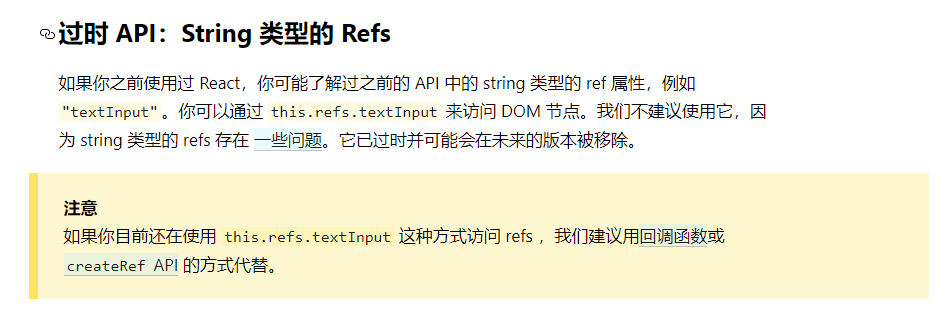
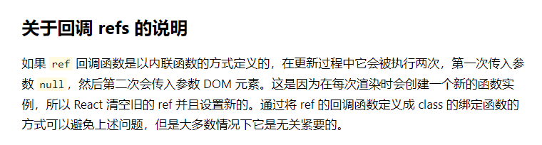

# 006-refs

react的refs就和vue2的refs一样，用来获取指定的DOM
```jsx
class App extends React.Component {
  componentDidMount () {
    console.log(this.refs.inp); // 通过refs获取dom
  }
  render () {
    return (<input ref="inp" type="text"/>);
  }
}
```


## 1、字符串形式的ref - 不推荐使用
像上面的例子，就是字符串的ref，[官网](https://reactjs.bootcss.com/docs/refs-and-the-dom.html)已经不推荐使用这种写法的ref，因为写错了页面的性能会降低很多




## 2、回调函数的ref - 推荐使用
当给ref传入一个回调函数的时候，react会自动调用该函数，并且将当前DOM对象作为参数传递给回调函数

那么就可以在回调函数中将该DOM赋值给类组件实例的属性上

比如下面的例子
```jsx
class App extends React.Component {
  componentDidMount () {
    console.log(this.inpRef);
  }
  render () {
    return (<input ref={curNode => {this.inpRef = curNode}} type="text"/>);
  }
}
```

看[官网](https://reactjs.bootcss.com/docs/refs-and-the-dom.html)对这种写法的ref有个说明



那么这个是什么意思呢，我们来看下面的例子

```jsx
class App extends React.Component {
  state = {age: 1};
  change = () => {
    this.setState({
      age: this.state.age+1
    });
  };
  render () {
    return (
      <div>
        <div ref={curNode => {console.log(curNode)}}></div>
        <p>age: {this.state.age}</p>
        <button onClick={this.change}>change</button>
      </div>
    );
  }
}
```
当刚刷新页面的时候`console.log(curNode)`被执行，并且`curNode=Div`没问题


而当我们点击按钮改变state，react会自动触发`render()`，这个时候`console.log(curNode)`就执行了2次，并且第1次的`curNode=null`，而第2次的`curNode=Div`

那么为什么会这样呢？
1. 页面刷新之后，第一次初始化组件，执行`render()`
2. 执行到`<div ref={curNode => {console.log(curNode)}}></div>`的时候，react发现ref接收的是一个函数，就会调用该函数，我们暂且将其命名为函数A
3. state改变，自动触发`render()`
4. react执行到`<div ref={curNode => {console.log(curNode)}}></div>`的时候，因为ref接收的是一个函数，这个时候的函数可不是函数A了，是一个新函数，之前的函数A执行完了被释放掉了。
5. react不知道之前函数A做了什么动作，为了保证能完整的清空，所以第1次传了个null
6. 然后react紧接着再调一次，这个时候就把当前的DOM节点传递进来

react官网已经说明，这个机制不会造成什么问题，如果一定要改，可以换成下面的写法
```jsx
class App extends React.Component {
  state = {age: 1};
  change = () => {
    this.setState({
      age: this.state.age+1
    });
  };
  // 1. 抽成一个属性+箭头
  setDom = (curNode) => {
    console.log(curNode);
    this.inpRef = curNode;
  };
  render () {
    return (
      <div>
      	{/* 2.这里ref改为调用方法 */}
        <div ref={this.setDom}></div>
        <p>age: {this.state.age}</p>
        <button onClick={this.change}>change</button>
      </div>
    );
  }
}
```


## 3、createRef - react最推荐的写法
react暴露了`createRef()`，该方法返回一个容器，该容器用来存储被ref标记的DOM

```jsx
class App extends React.Component {
  myInp = React.createRef();
  
  componentDidMount() {
    console.log(this.myInp.current); // 获取到DOM
  }

  render () {
    return (
      <div ref={this.myInp}>1111</div>
    );
  }
}
```

> 注意: `createRef()`只能存一个DOM对象，如果一个html中有多个同名的ref，只会认最后一个
```jsx
class App extends React.Component {
  myInp = React.createRef();
  
  componentDidMount() {
    console.log(this.myInp.current); // 得到的是<h2>
  }

  render () {
    return (
      <div>
      	<h1 ref={this.myInp}>1111</h1>
      	<h2 ref={this.myInp}>2222<h2v>
      </div>
    );
  }
}
```