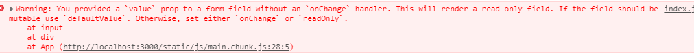

# 007-受控和非受控组件

受控和非受控组件是针对表单组件而言的


## 1、非受控组件
非受控组件，表单元素的数据不在state维护，等需要获取表单元素的值时候，通过refs去获取

设置默认值得时候，也不能通过value属性去设置，得通过defaultValue属性
```jsx
class App extends React.Component {
  myInp = React.createRef();
  subHandl = () => {
    console.log(this.myInp.current.value);
  };
  render () {
    return (
      <div>
      <input defaultValue="ddd" ref={this.myInp} />
      <button onClick={this.subHandl}>提交</button>
      </div>
    );
  }
}
```

> 为什么不能通过value设置默认值？在react中，value有特别的用处，一定你在表单组件使用了value属性，react就会要求你用onChange事件。比如代码`<input value="ddd" ref={this.myInp} />`。而你用了`onChange+value`组合，那这就是一个受控组件




## 2、受控组件

表单组件受到state控制的为受控组件，这也是react比较推荐的写法

```jsx
class App extends React.Component {
  state = {
    name: 'xiaoming'
  };
  saveName = (ev) => {
    this.setState({name: ev.target.value});
  };
  subHandl = () => {
    console.log(this.state.name);
  };
  render () {
    return (
      <div>
        <input value={this.state.name} onChange={this.saveName} />
        <button onClick={this.subHandl}>提交</button>
      </div>
    );
  }
}
```