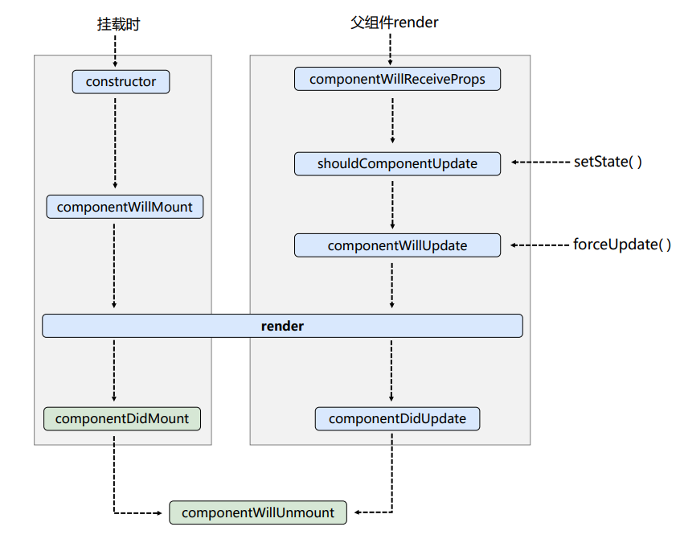
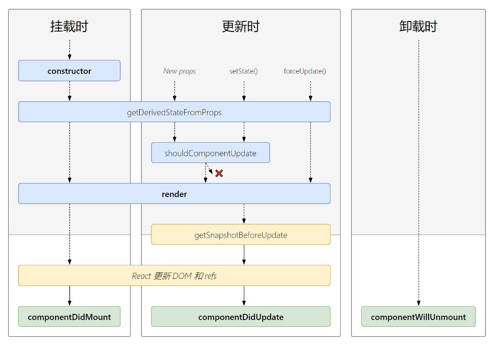

# 009-react的生命周期


## 1、旧版本的生命周期(react17.0.0以前的)
react所拥有的声明周期

1. 首次挂载

触发: `constructor - componentWillMount - render - componentDidMount`


2. 通过setState改变状态

触发: `shouldComponentUpdate - componentWillUpdate - render - componentDidUpdate`

> `shouldComponentUpdate`能控制更不更新视图，当`shouldComponentUpdate()=false`的时候，就不更新视图了，后面的生命周期也就不会触发。

> 当`shouldComponentUpdate()=false`的时候，视图虽然不会更新，但js内存内的变量还是改了
```jsx
class App extends React.Component {
  state = {
    age: 1
  }
  // 返回false不更新视图
  shouldComponentUpdate () {
    return false;
  }
  change = () => {
    this.setState({age: this.state.age+1}); // setState调用，视图不会更新
    console.log(this.state.age); // 但js中的age变量还是会变
  }
  render () {
    return (
      <div>
        <h1>Hello{this.state.age}</h1>
        <button onClick={this.change}>更新</button>
      </div>
    )
  }
}
```

3. 通过forceUpdate强制重新渲染

触发: `componentWillUpdate - render - componentDidUpdate`

> 既然叫强制，那就没有类似 `shouldComponentUpdate`这种可以控制更新不更新的生命周期了

> 当触发`forceUpdate()`，react会重新拿state里面的最新状态去更新
```jsx
class App extends React.Component {
  state = {
    age: 1
  }
  change = () => {
    this.state.age += 1; // 这里仅仅改变js中的age变量，不会触发render
    this.forceUpdate(); // 强制触发render，会用age的最新的值去渲染
  }
  render () {
    return (
      <div>
        <h1>Hello{this.state.age}</h1>
        <button onClick={this.change}>更新</button>
      </div>
    )
  }
}
```


4、父组件触发render

无论父组件是因为什么原因，触发了父组件的render后，子组件会触发下面的生命周期: `componentWillReceiveProps - shouldComponentUpdate - componentWillUpdate - render - componentDidUpdate`

> 可以这么记住，只要父组件触发render，就会重新渲染子组件，那就触发componentWillReceiveProps和一系列更新的生命周期。和父组件传不传props、props有没有更新都没有关系

> componentWillReceiveProps在父组件第1次挂载触发`render()`的时候，不会触发，当挂载后父组件触发`render()`才会触发

```
// 子组件
class Son extends React.Component {
  // 父组件并没有传递props过来，但是当父组件改变state触发render后
  // 子组件的componentWillReceiveProps也会触发
  componentWillReceiveProps (props) {
    console.log('son-componentWillReceiveProps', props);
  }
  render () {
    return (
      <div>
        <h1>this is Son Component: {this.props.age}</h1>
      </div>
    )
  }
}

// 父组件
class App extends React.Component {
  state = {
    age: 1
  }
  change = () => {
    this.setState({age: this.state.age+1});
  }
  render () {
    return (
      <div>
        <h1>Hello{this.state.age}</h1>
        <Son></Son>
        <button onClick={this.change}>更新</button>
      </div>
    )
  }
}
```


## 2、新版本的生命周期
改动点:

* `componentWillMount/componentWillUpdate/componentWillReceiveProps` 几个带will（除了componentWillUnmont）的生命周期要加前缀 `UNSAFE_`。命名为`UNSAFE_componentWillMount/UNSAFE_componentWillUpdate/UNSAFE_componentWillReceiveProps`

[【React为什么要做出这种改动】](https://reactjs.bootcss.com/blog/2018/03/27/update-on-async-rendering.html)

我们是推荐直接不使用者3个生命周期了


* 新增2个生命周期: `getDerivedStateFromProps / getSnapshotBeforeUpdate`


## 3、新旧生命周期对比图
旧的生命周期图:



新的生命周期图:

