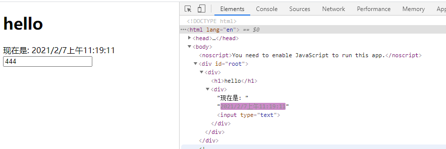
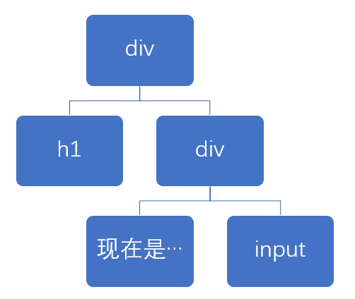
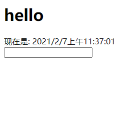

# 010-diff算法


我们知道，react是先将数据生成一个虚拟dom(命名为vDOM-A)，然后再生成真是DOM

当数据发生变化的时候，会再生成一个虚拟dom(命名为vDOM-B)，然后将vDOM-B和vDOM-A进行对比
* 对比没有变化的，就不会更新真实DOM。
* 对比有变化的，就会更新真实DOM，更新的最小颗粒是标签

我们写个简单的例子:
```jsx
class App extends React.Component {
  state = {
    curDate: new Date()
  }
  componentDidMount () {
    setInterval(() => this.setState({curDate:new Date()}), 1000);
  }
  render () {
    return (
      <div>
        <h1>hello</h1>
        <div>现在是: {this.state.curDate.toLocaleString()} <input type="text"/></div>
      </div>
    );
  }
}
```
页面效果:



对应的虚拟DOM如下:




当**数据改变**发生改变，例子中是`state.curDate`发生变化了，react就会触发`render()`。然后一层层的对比

1. 比较`<h1>` 没有发生变化，那么就不更新
2. 比较`<div>` 发现里面的文字改了，那么就需要更新真实DOM，react更新的最小颗粒是标签，所以连`"现在是"`这几个字也是会更新的，只是更新出来的一样而已
3. 比较`<input>`发现没有变化，不更新


验证: 假如diff不是这么算的，那么我们在input输入内容，定时器每1s就会触发render，那么我们输入的内容就不见了。之所以没有出现这种问题，就是因为diff算法起的作用

