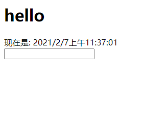
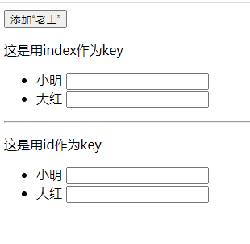

# 012-key的作用

## 1、经典的面试题
* 在vue/react中，key的作用?
* key的内部原理?
* 为什么循环遍历的时候，key最好不用index?


### 1.1 用index作key的例子

首先我们写个经典的例子，用户列表，点击按钮，往用户列表头新增一个客户
```jsx
class App extends React.Component {
  state = {
    list: [
      {id:'c101', name: '小明'},
      {id:'c102', name: '大红'}
    ]
  }
  addWang = () => {
    const newUser = {id:'c103', name:'老王'};
    this.setState({
      list: [newUser, ...this.state.list]
    });
  }

  render () {
    return (
      <div>
        <button onClick={this.addWang}>添加“老王”</button>
        <ul>
          {this.state.list.map((user, $index) => {
            return <li key={$index}>{user.name}</li>
          })}
        </ul>
      </div>
    )
  }
}
```
页面效果:



效果和我们想的一样，但是底层的性能完全不一样了。


**底层原理:**

根据diff算法我们知道，当点击按钮调用setState改变数据后，触发render，react就会生成一个新的vDOM，接着将 新vDOM的key 在 旧vDOM中对比，相同的key做比较，如果内容发生变化则更新。

**慢动作回放:**

根据前面的更新规则，我们来捋一捋上面例子的更新过程

1. 在还没点击按钮之前的vDOM是下面的结构
```
数据: [
    {name: '小明'}
    {name: '大红'}
]

对应的vDOM:
    <li key=0>小明</li>
    <li key=1>大红</li>
```

2. 点击按钮后，数据发生改变
```
数据: [
    {name: '老王'}
    {name: '小明'}
    {name: '大红'}
]

对应的vDOM:
    <li key=0>老王</li>
    <li key=1>小明</li>
    <li key=2>大红</li>
```

3. diff开始对比

首先拿新vDOM的`<li key=0>老王</li>` 中`key=0`，那么去旧vDOM中找到`key=0`的数据，找到了`<li key=0>小明</li>`，对比内容不一样，于是更新真实DOM

接着拿新vDOM的`<li key=1>小明</li>` 中`key=1`，那么去旧vDOM中找到`key=1`的数据，找到了`<li key=1>大红</li>`，对比内容不一样，于是更新真实DOM

接着拿新vDOM的`<li key=3>大红</li>` 中`key=3`，那么去旧vDOM中找到`key=3`的数据，没有找到，于是更新真实DOM

这么算下来，一共有3次更新真实DOM的操作


### 1.2 用id作为key的例子

同样的场景，只是我们该用id作为key
```jsx
<ul>
  {this.state.list.map((user) => {
    return <li key={user.id}>{user.name}</li>
  })}
</ul>
```

**这种的慢动作:**

1. 在还没点击按钮之前的vDOM是下面的结构
```
数据: [
    {name: '小明'}
    {name: '大红'}
]

对应的vDOM:
    <li key="c101">小明</li>
    <li key="c102">大红</li>
```

2. 点击按钮后，数据发生改变
```
数据: [
    {name: '老王'}
    {name: '小明'}
    {name: '大红'}
]

对应的vDOM:
    <li key="c103">老王</li>
    <li key="c101">小明</li>
    <li key="c102">大红</li>
```

3. diff开始对比

首先拿新vDOM的`<li key="c103">老王</li>` 中`key=c103`，那么去旧vDOM中找到`key=c103`的数据，没有找到，于是更新真实DOM

接着拿新vDOM的`<li key="c101">小明</li>` 中`key=c101`，那么去旧vDOM中找到`key=c101`的数据，找到了`<li key="c101">小明</li>` 发现内容没有变化，直接复用，不更新真实DOM

接着拿新vDOM的`<li key="c102">大红</li>` 中`key=c102`，那么去旧vDOM中找到`key=c102`的数据，找到了`<li key="c102">大红</li>` 发现内容没有变化，直接复用，不更新真实DOM

这么算下来，一共有1次更新真实DOM的操作。性能提高了很多


### 1.3 加上个input，还是用index作为key

如果在`<li>`里面加个`<input>`，那么index作为key就会出问题了。

还是前面的例子，改下jsx加个`<input>`
```jsx
<div>
    <button onClick={this.addWang}>添加“老王”</button>
    <p>这是用index作为key</p>
    <ul>
      {this.state.list.map((user, $index) => {
        return <li key={$index}>{user.name}  <input type="text"/></li>
      })}
    </ul>

    <hr />

    <p>这是用id作为key</p>
    <ul>
      {this.state.list.map((user, $index) => {
        return <li key={user.id}>{user.name}  <input type="text"/></li>
      })}
    </ul>
  </div>
```

在点击按钮之前，我们输入点内容，然后再点击添加，如果是`key=$index`的，会出现输入的内容错位了



还是用前面的知识解答

**用key=$index的是这么场景**

1. 在还没点击按钮之前的vDOM是下面的结构
```
数据: [
    {name: '小明'}
    {name: '大红'}
]

对应的vDOM:
    <li key="0">小明 <input type="text"></li>
    <li key="1">大红 <input type="text"></li>
```

2. 点击按钮后，数据发生改变
```
数据: [
    {name: '老王'}
    {name: '小明'}
    {name: '大红'}
]

对应的vDOM:
    <li key="0">老王 <input type="text"></li>
    <li key="1">小明 <input type="text"></li>
    <li key="2">大红 <input type="text"></li>
```

3. diff开始对比

首先拿新vDOM的`<li key="0">老王 <input type="text"></li>`，那么去旧vDOM中找到`key=0`的数据，找到了`<li key="0">小明 <input type="text"></li>`，对比内容不一样，于是更新真实DOM。然对比里面的`<input>`发现`<input>`没有变化则不会更新`<input>`，所以这个`<input>`还保留着我们输入的内容

其他依次类推


## 2、总结

### 2.1 虚拟DOM中key的作用
1). 简单的说: key是虚拟DOM对象的标识, 在更新显示时key起着极其重要的作用。

2). 详细的说: 当状态中的数据发生变化时，react会根据【新数据】生成【新的虚拟DOM】, 随后React进行【新虚拟DOM】与【旧虚拟DOM】的diff比较，比较规则如下：
* 旧虚拟DOM中找到了与新虚拟DOM相同的key：若虚拟DOM中内容没变, 直接使用之前的真实DOM。若虚拟DOM中内容变了, 则生成新的真实DOM，随后替换掉页面中之前的真实DOM
* 旧虚拟DOM中未找到与新虚拟DOM相同的key，根据数据创建新的真实DOM，随后渲染到到页面
           

### 2.2 用index作为key可能会引发的问题      
1. 若对数据进行：逆序添加、逆序删除等破坏顺序操作: 会产生没有必要的真实DOM更新 ==> 界面效果没问题, 但效率低。
2. 如果结构中还包含输入类的DOM：会产生错误DOM更新 ==> 界面有问题。
3. 注意！如果不存在对数据的逆序添加、逆序删除等破坏顺序操作，

仅用于渲染列表用于展示，使用index作为key是没有问题的。
          

### 2.3 开发中如何选择key
* 最好使用每条数据的唯一标识作为key, 比如id、手机号、身份证号、学号等唯一值。
* 如果确定只是简单的展示数据，用index也是可以的。