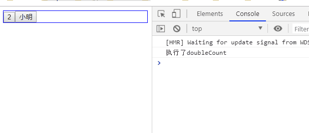

# 019-hooks

hooks是为函数组件为生
```jsx
function App () {
  return <h1>Hello</h1>
}

ReactDOM.render(<App />, document.getElementById('root'));
```
我们知道，函数组件是没有state状态的

所以hooks的出现改变了这一现象


## 1、useState
`useState()`方法
* 接收一个值，该值会作为默认值
* 返回一个数组，数组第1个元素是设置的值，第2个元素是改变值的方法

```jsx
import {useState} from 'react';

export default function Child () {
    const [count, setCount] = useState(0); // 调用第2个方法既可改变值
    const changeCount = () => {
        setCount(count+1);
    }
    return (
        <div>
            {count} 
            <button onClick={changeCount}>改变</button>
        </div>
    )
}
```


## 2、useEffect
副作用函数，用来充当生命周期使用的
* 在`render()`之后执行，即组件挂载完成、数据更新DOM后会执行
* `useEffect()`根据参数不同，有不同的作用

### 2.1 接受一个函数
第1个参数为函数，表示组件挂载完成、数据更新DOM后的回调（可以理解监听了所有属性）

```jsx
import { useState, useEffect } from "react";
export default function ChildFun () {
    const [count, setCount] = useState(1);
    const [name, setName] = useState('小明');
    useEffect(() => {
        console.log('useEffect');
    });
    return (
        <div className="child-fun">
            <button onClick={() => setCount(count+1)}>{count}</button>
            <button onClick={() => setName(name+'a')}>{name}</button>
        </div>
    );
}
```
* 接受一个函数，则该函数会在挂载和跟新数据后调用


### 2.2 接受第2个参数，是一个数组
`useEffect()`可以接受第2个参数，表示要监听哪个状态，当状态发生改变就会触发回调

```jsx
import { useState, useEffect } from "react";
export default function ChildFun () {
    const [count, setCount] = useState(1);
    const [name, setName] = useState('小明');
    useEffect(() => {
        console.log('useEffect');
    }, [count]);
    return (
        <div className="child-fun">
            <button onClick={() => setCount(count+1)}>{count}</button>
            <button onClick={() => setName(name+'a')}>{name}</button>
        </div>
    );
}
```
像上面例子中，因为`useEffect()`第2个参数是`[count]`，所以当组件挂载完成/count变量发生改变，就会触发回调


如果第2个参数传递的是一个空数组`[]`，那么这个`useEffect()`就不会监听任何变量，只会在组件挂载完成的时候回调一次
```jsx
useEffect(() => {
    console.log('useEffect');
}, []);
```


### 2.3 第1个参数里面返回一个函数
第1个参数是回调函数A，如果里面再return一个函数B，那么该函数B会在调用函数A前调用一次。并且如果组件销毁了，也会调用函数B
```jsx
export default function ChildFun () {
    const [count, setCount] = useState(1);
    const [name, setName] = useState('小明');
    useEffect(() => {
        return () => {
            console.log('render之后，useEffect之前');
        };
    }, [count]);
    return (
        <div className="child-fun">
            <button onClick={() => setCount(count+1)}>{count}</button>
            <button onClick={() => setName(name+'a')}>{name}</button>
        </div>
    );
}
```


## 3、useLayoutEffect
`useLayoutEffect()`和`useEffect()`接受的参数和含义是一样的，只是2者触发的时机不同

* `useLayoutEffect()`是在DOM更新之后触发
* `useEffect()`是在`render()`之后触发


## 4、useMemo
类似vue的computed，首先我们来看下面这个场景
```jsx
export default function ChildFun () {
    const [count, setCount] = useState(1);
    const [name, setName] = useState('小明');
    // 将count*2
    function doubleCount () {
        console.log('执行了doubleCount');
        return count*2;
    }
    return (
        <div className="child-fun">
            <button onClick={() => setCount(count+1)}>{doubleCount()}</button>
            <button onClick={() => setName(name+'a')}>{name}</button>
        </div>
    );
}
```
按钮一展示的文案是`{count*2}`，无论我们只改变了count的值还是改变name的值，都会触发`doubleCount()`的调用，如下:



当我们支持改变name的值的时候，其实执行`doubleCount()`是一种浪费行为。所以可以用`useMemo()`来声明一个计算属性

```jsx
export default function ChildFun () {
    const [count, setCount] = useState(1);
    const [name, setName] = useState('小明');
    
    const doubleCount = useMemo(() => {
        console.log('执行了doubleCount');
        return count*2;
    }, [count]);

    return (
        <div className="child-fun">
            <button onClick={() => setCount(count+1)}>{doubleCount}</button>
            <button onClick={() => setName(name+'a')}>{name}</button>
        </div>
    );
}
```

* `useMemo()`接受第2个参数是一个数组，数组里面有元素改变了，就会触发`useMemo()`的回调。

比如硬是这么写，那么count/name改变都会触发里面的回调
```jsx
const doubleCount = useMemo(() => {
    console.log('执行了doubleCount');
    return count*2;
}, [count, name]); // 明明回调里面没有用到name，还硬要写上
```


### 4.1 同时改变状态
当多次调用改变状态的时候，`useMemo()`只会执行一次
```jsx
export default function ChildFun () {
    const [count, setCount] = useState(1);
    const [name, setName] = useState('小明');

    const doubleCount = useMemo(() => {
        console.log('执行了doubleCount');
        return (count*2)+name;
    }, [count, name]);

    // 同时改变name/count的值，useMemo()也是只执行一次
    function say () {
        setCount(count+1);
        setName(name+'a');
    }

    return (
        <div className="child-fun">
            <button onClick={ () => say() }>{doubleCount}</button>
        </div>
    );
}
```


## 5、useCallback
和`useMemo()`作用类似，不需要传递第2个参数依赖数组


