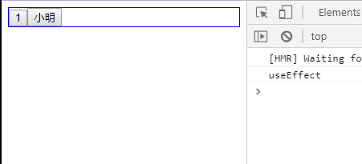
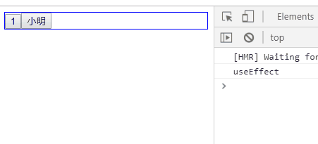
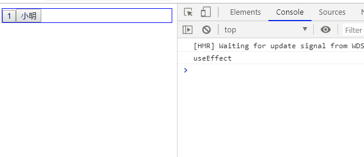

# 020-hooks-useEffect和useLayoutEffect


## 1、useEffect
副作用函数，用来充当生命周期使用的
* 在`render()`之后执行，即组件挂载完成、数据更新DOM后会执行
* `useEffect()`根据参数不同，有不同的作用

### 1.1 接受一个函数
第1个参数为函数，表示组件挂载完成、数据更新DOM后的回调（可以理解监听了所有属性）

```jsx
import { useState, useEffect } from "react";
export default function ChildFun () {
    const [count, setCount] = useState(1);
    const [name, setName] = useState('小明');
    useEffect(() => {
        console.log('useEffect');
    });
    return (
        <div className="child-fun">
            <button onClick={() => setCount(count+1)}>{count}</button>
            <button onClick={() => setName(name+'a')}>{name}</button>
        </div>
    );
}
```
* 接受一个函数，则该函数会在挂载和跟新数据后调用




### 1.2 接受第2个参数，是一个数组
`useEffect()`可以接受第2个参数，表示要监听哪个状态，当状态发生改变就会触发回调

```jsx
import { useState, useEffect } from "react";
export default function ChildFun () {
    const [count, setCount] = useState(1);
    const [name, setName] = useState('小明');
    useEffect(() => {
        console.log('useEffect');
    }, [count]);
    return (
        <div className="child-fun">
            <button onClick={() => setCount(count+1)}>{count}</button>
            <button onClick={() => setName(name+'a')}>{name}</button>
        </div>
    );
}
```
像上面例子中，因为`useEffect()`第2个参数是`[count]`，所以当组件挂载完成/count变量发生改变，就会触发回调




如果第2个参数传递的是一个空数组`[]`，那么这个`useEffect()`就不会监听任何变量，只会在组件挂载完成的时候回调一次
```jsx
useEffect(() => {
    console.log('useEffect');
}, []);
```


### 1.3 第1个参数里面返回一个函数
第1个参数是回调函数A，如果里面再return一个函数B，那么该函数B会在调用函数A前调用一次。并且如果组件销毁了，也会调用函数B
```jsx
export default function ChildFun () {
    const [count, setCount] = useState(1);
    const [name, setName] = useState('小明');
    useEffect(() => {
        return () => {
            console.log('render之后，useEffect之前');
        };
    }, [count]);
    return (
        <div className="child-fun">
            <button onClick={() => setCount(count+1)}>{count}</button>
            <button onClick={() => setName(name+'a')}>{name}</button>
        </div>
    );
}
```




## 2、useLayoutEffect
`useLayoutEffect()`和`useEffect()`接受的参数和含义是一样的，只是2者触发的时机不同

* `useLayoutEffect()`是在DOM更新之后触发
* `useEffect()`是在`render()`之后触发
