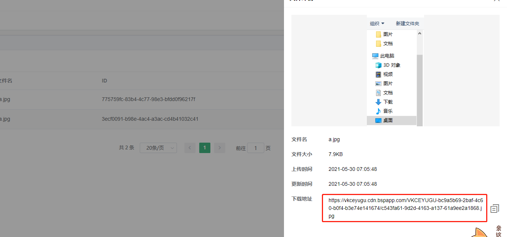

# 105-云存储

## 1、将图片上传到云存储

```js
uni.chooseImage({
    success (res) {
        that.imgUrl = res.tempFilePaths[0]; // 用来预览
        
        uniCloud.uploadFile({ 
            filePath: that.imgUrl,
            cloudPath: 'a.jpg', // 将作为文件名，即使有相同名称也不会替换
            success (res) {
                console.log('上传后结果', res);
            },
            fail (err) {
                console.log('上传失败', err);
            }
        })
    }
})
```
注意这里是`uniCloud.uploadFile()`而不是`uni.uploadFile()`。前者才是云函数的方法，上传到云存储里面，后者是用来上传到我们自己的服务器


## 2、从云存储删除图片
删除首先要知道地址，在下面地方可以知道



然后调用
```js
uniCloud.deleteFile({
    fileList:['https://vkceyugu.cdn.bspapp.com/2a1868.jpg'],
    success (res) {
        console.log('成功', res);
    }
})
```
该函数使用需要一定[权限](https://uniapp.dcloud.io/uniCloud/storage?id=deletefile)
