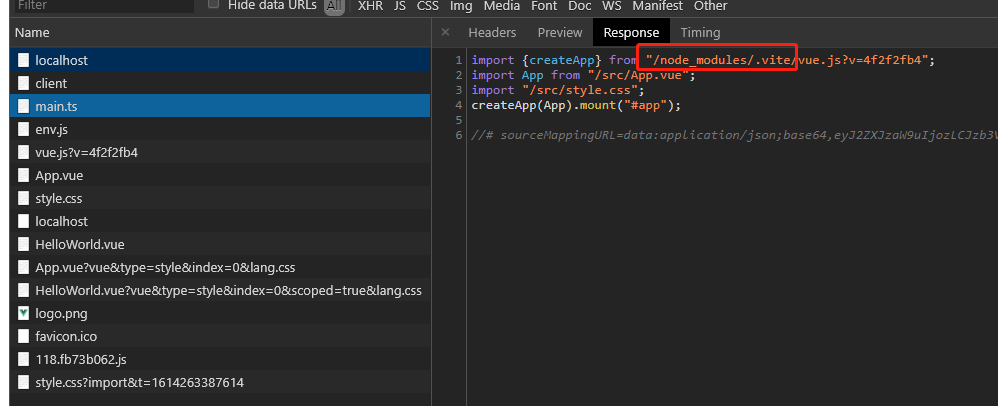

# 001-vite入门

vite是构建工具，开发周期它利用浏览器支持`es module`的特性，生产打包利用rollup打包

## 1、初始化
初始化项目
```bash
npm init @vitejs/app
```
会出现选择界面


也可以直接执行:
```bash
# npm 6.x
npm init @vitejs/app my-vue-app --template vue

# npm 7+, extra double-dash is needed:
npm init @vitejs/app my-vue-app -- --template vue
```

`--template`支持的有以下配置:
* vanilla
* vue
* vue-ts
* react
* react-ts
* preact
* preact-ts
* lit-element
* lit-element-ts


## 2、vite利用浏览器原生支持esModule的特点

在`/public/index.html`中可以看到是这么引入js
```html
<script type="module" src="/src/main.ts"></script>
```
`type="module"`是告诉浏览器这是esModule模块，接着浏览器就会用esModule的去解析`main.ts`

`main.ts`的内容如下:

```js
import { createApp } from 'vue';
import App from './App.vue'
import './style.css'
createApp(App).mount('#app')
```

那么，
* 对于`import { createApp } from 'vue'`，这种第3方包的，浏览器怎么知道这些`vue`是要去node_module里面找
* 对于`import App from './App.vue'`，这是相对路径，浏览器知道在哪儿，但是这是`.vue`后缀的，浏览器怎么知道如何解析
* 对于`import './style.css'`，浏览器也能找到文件，但是浏览器怎么解析，等我们用了scss等，浏览器又怎么解析

像上面这些问题，就是vite所解决的

我们启动项目，到浏览器看运行过程，关注netWork网络加载的地方



从上面可以看到`main.ts`中的`'vue'`已经变成了`"/node_modules/.vite/vue.js?v=4f2f2fb4"`

说明vite会对node_module的包稍作修改，作为绝对路径加载，从而加载`vue.js`


## 3、资源加载可以用绝对路径
资源路径可以用绝对路径的方式加载

比如加载图片``这样就会
