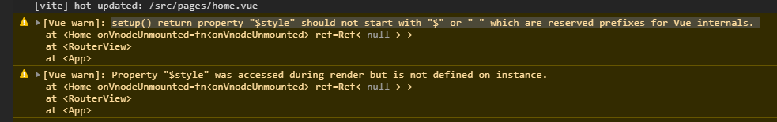

# 002-处理css


## 1、自动加前缀+px2rem

安装: `npm install postcss-pxtorem autoprefixer -D`

新建`postcss.config.js`，内容如下:
```js
module.exports = {
    plugins: {
        autoprefixer: {},
        'postcss-pxtorem': {
            rootValue: 75,
            propList: ['*'],
            minPixelValue: 2, // 小于2px的不会转为rem，等于2的还是会转
            // selectorBlackList: [/^.van-\w*/], // 不要转vant的，他们是375位基准的
            exclude: /node_modules/i // 忽略node_modules里面的，就不会转vant的
        }
    }
};
```

在`/src/utils/rem.ts`，内容如下
```js
const baseSize = 75; // 注意此值要与 postcss.config.js 文件中的 rootValue保持一致
const doc = document.documentElement;
function setRem () {
    // 当前页面宽度相对于 750宽的缩放比例，可根据自己需要修改,一般设计稿都是宽750(图方便可以拿到设计图后改过来)。
    const scale = doc.clientWidth / 750; // 750设计稿的宽度
    const fontSize = baseSize * scale;
    doc.style.fontSize = `${Math.min(fontSize, 80)}px`; // 设置页面根节点字体大小 最大值80px
}
// 初始化
setRem();

// 改变窗口大小时重新设置 rem
let timer = 0;
window.onresize = function () {
    timer && window.clearTimeout(timer);
    timer = setTimeout(setRem, 200);
};
```

新建`/.browserslistrc`，内容如下:

```text
> 1%
last 2 versions
```

重启，就会自动加上前缀和px转为rem了


## 2、dart-sass处理scss
安装`npm i -D sass`即可


## 3、css module处理css
在vue组件中，我们最常用的是单文件的写法，单文件的css module，给`<style>`加上`module`属性即可
```vue
<template>
    <div :class="$style.box">this is home page</div>
</template>

<style lang="scss" module>
.box {
    color: red;
}
</style>
```


如果是通过css是通过import导入的，则需要把css的文件名称改为`xxx.module.scss`，并且需要自己实现`$style`的逻辑
```vue
<template>
    <div :class="$style.box">Hello</div>
</template>

<script lang='ts'>
import { defineComponent, computed } from 'vue'
import style from '@/assets/style.module.scss';
export default defineComponent({
    computed: {
        $style () {
            return style
        }
    }
})
</script>
```

如果是要用compositonApi的话，就不能命名为`$style`了，因为setup的return里面不能以`$ 或 _`开头

比如改为下面:
```ts
export default defineComponent({
    setup () {
        const $style = computed(() => style);

        return { $style };
    }
})
```
vue会提示`setup() return property "$style" should not start with "$" or "_" which are reserved prefixes for Vue internals. `



把`$style`改个名字即可
```vue
<template>
    <div :class="myStyle.box">Hello</div>
</template>

<script lang='ts'>
import { defineComponent, computed } from 'vue'
import style from '@/assets/style.module.scss';
export default defineComponent({
    setup () {
        const myStyle = computed(() => style);

        return { myStyle };
    }
})
</script>
```
