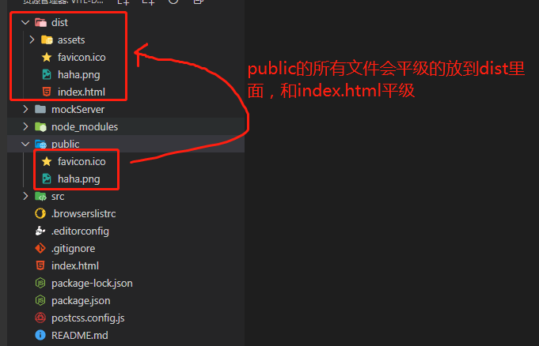

# 004-关于public文件


`/public`里面的文件不会经过任何处理，build之后会放在`dist`目录里面



所以，对于想要引入`/public`里面的资源，写代码的时候，需要写成`/`绝对路径
```html

```

然后打包的时候，有时候我们是想要通过`http://xxx.com/cloudpay`去访问我们的项目的，就修改下`vite.config.ts`的base选项
```ts
export default defineConfig({
    base: './'
});
```