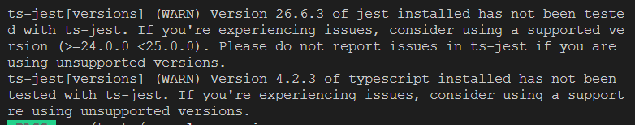
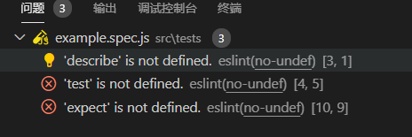

# 007-jest单元测试

安装:
```bash
npm i -D 
    jest 
    ts-jest@24
    vue-jest@next
    babel-jest 
    @babel/preset-env 
    @vue/test-utils@next
```

> `vue-jext`要`5.0.0版本上的`，否则会提示`Cannot find module 'vue-template-compiler'`

> `jest`的`26.6.3`版本后，不会自动集成`ts-jest`了，如果是ts项目，则需要单独装个

> `ts-jest`需要安装`24~25`之间的，否则会提示



> `@vue/test-utils`如果是跟vue3搭配，在需要`2.0.0`版本以上


配置`babel.config.js`，内容如下:
```js
module.exports = {
    presets: [
        [
            "@babel/preset-env", {
                targets: {
                    node: "current"
                }
            }
        ]
    ],
};
```

配置`jest.config.js`，内容如下:
```js
module.exports = {
    testEnvironment: "jsdom",
    transform: {
        "^.+\\.vue$": "vue-jest",
        "^.+\\js$": "babel-jest",
    },
    moduleFileExtensions: ["vue", "js", "json", "jsx", "ts", "tsx", "node"],
    testMatch: ["**/tests/**/*.spec.js", "**/__tests__/**/*.spec.js"],
    moduleNameMapper: {
        "^main(.*)$": "<rootDir>/src$1",
    },
};
```

配置`package.json`
```json
{
    "script": {
        "test": "jest --runInBand"
    }
}
```

新建单元测试代码`/tests/example.spec.js`，内容如下:
```js
import HelloWorld from 'main/components/HelloWorld.vue';
import { shallowMount } from '@vue/test-utils';
describe('aaa', () => {
    test('should ', () => {
        const wrapper = shallowMount(HelloWorld, {
            props: {
                msg: 'hello,vue3'
            }
        });
        expect(wrapper.text()).toMatch('hello,vue3');
    });
});
```
对应的`HelloWorld.vue`
```vue
<template>
    <div class="box">{{msg}}</div>
</template>

<script lang="ts">
import { defineComponent } from 'vue';

export default defineComponent({
    props: {
        msg: { type: String, default: '' }
    }
});
</script>
```

如果加了eslint后，会看到单元测试的代码里面有很多未定义的



那是因为eslint不认识jest，往`.eslintrc.js`新增下面代码：
```js
module.exports = {
    env: {
        node: true, // eslint认识node语法
        jest: true // eslint认识jext语法
    }
}
```