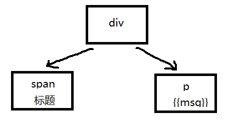
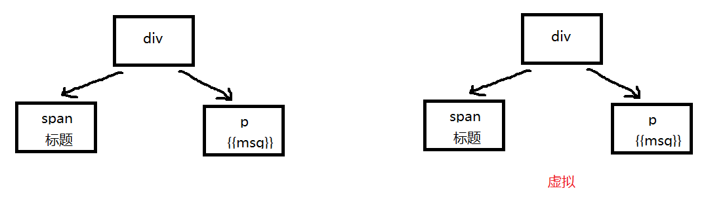
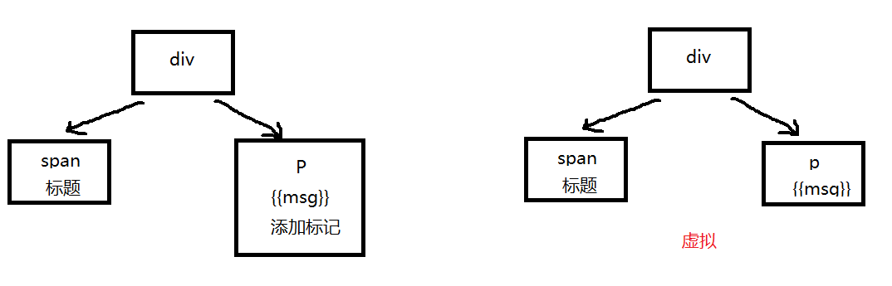
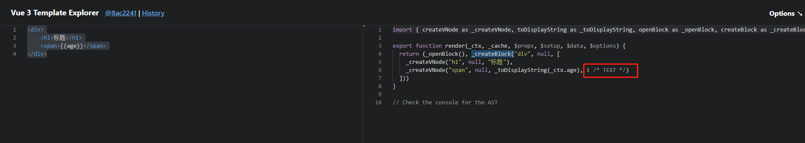
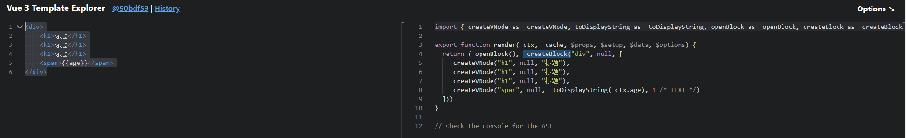
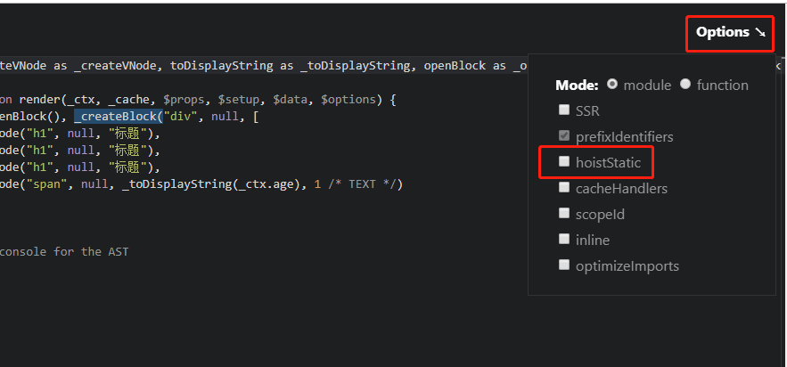
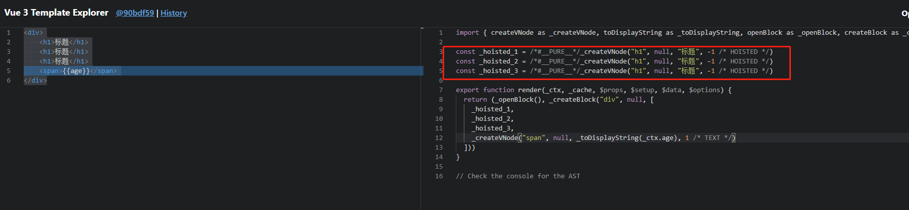
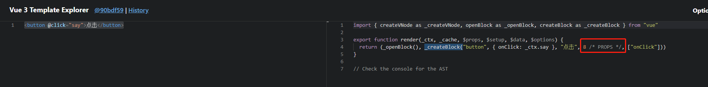
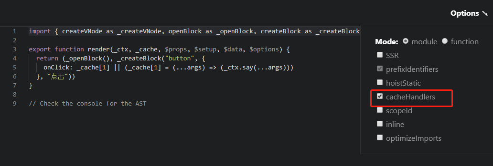
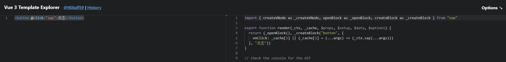

# 002-diff的升级

比如下面代码:
```html
<div>
    <span>标题</span>
    <span>{{age}}</span>
</div>
```

在vue@2中，会根据上面的DOM生成一个DOM树，如下:



当数据发生改变，vue会生成一个新的虚拟DOM数，如下:



然后，从 `div` 开始一个个进行比较，最后发现是 `span` 改变了，那么就把span替换掉

这样其实有点问题，像 `div/span` 是写死的，无论数据怎么变， `div/h1` 都不会变，其实是没有必要进行对比的，这就是vue@3所解决的diff算法。

vue@3在创建DOM树的时候给DOM会发生变化的添加静态标识，当数据发生变化的时候，只对比有静态标识的DOM



验证上面的想法，在(官方在线编译vue代码)[https://vue-next-template-explorer.netlify.app/]上编辑我们的代码，得到下面结果：



从图中可以看出，有数据绑定的有 `1` 这个标识

在vue@3中，像 `1` 的这种标识还有如下：
* `1`: 动态文本节点，`text = 1`
* `2`: 动态class，`class = 1 << 1` 
* `4`: 动态style，`style = 1 << 2`
* `8`: 动态属性，不包含类名和样式，`props = 1 << 3`
* `16`: 具有动态key属性，当key改变时，需要进行完整的diff比较，`full_props = 1 << 4`
* `32`: 具有监听事件的节点，`hydrate_events = 1 << 5`
* `64`: 一个不会改变子节点顺序的frament，`stable_fragment = 1 << 6`
等等

这一部分定义在[枚举里面](https://github.com/vuejs/vue-next/blob/master/packages/shared/src/patchFlags.ts)


## 2、静态提升
在 vue@2 中，无论元素是否参与更新，都要被重新创建，然后再渲染

在 vue@3 中，对于不参与更新的元素，会做静态提升，只会被创建一次，在渲染的时候复用即可

验证，还是借助[vue编译平台](https://vue-next-template-explorer.netlify.app)

有下面代码:
```html
<div>
    <h1>标题</h1>
    <h1>标题</h1>
    <h1>标题</h1>
    <span>{{age}}</span>
</div>
```
如果没有静态提升，编译后是下面结果



可以看出，每次数据发生改变的时候，会调用render，而render每次都有调用 `createNode` 去渲染3个写死的 `<h1>`

我们点击 `options - hoistatic` 让其开启静态提升功能



相同的代码，得到下面的结果:



可以看到，没有数据绑定的3个 `<h1>` 被提取到了 render 外面，当数据发生改变调用render，render里面直接拿外面创建好的，而不会又再调用render去创建 `<h1>`


## 3、事件缓存
默认情况下，`@click` 会被视为动态绑定，所以每次都会去追踪它的变化。但是因为是同一个函数，其实没必要跟踪，直接缓存起来复用即可。

还是借助[vue在线编译平台](https://vue-next-template-explorer.netlify.app)

比如下面代码:
```html
<button @click="say">点击</button>
```

在开启事件缓存之前，编译结果如下:



可以开出，在开启事件缓存之前，编译后的代码有个静态标记 `8`。在前面diff算法中我们知道数字8表示属性绑定，每次数据发生改变，就会对比。

但是在事件中，我们绑定的是一个函数，其实是没有必要进行对比的。

开启事件缓存



开启事件缓存之后，相同代码编译结果



可以看出，现在已经没有静态标识了，当数据发生改变，也不会触发校验


