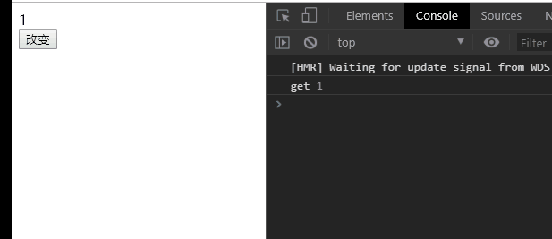

# 007-customRef

这章涉及api: `customRef()`


`customRef()`可以让我们自己定义一个ref函数

自定义函数格式: 
```js
// 自定义一个ref函数
// 接受一个参数，这个参数是内存中ref的值
// 里面return customRef()
function useDebouncedRef(value) {
    return customRef((track, trigger) => {
        return {
            get () {},

            // 这里的newVal是我们每次调用 .value=12 中的12
            // 这里的set()在初始化的时候不会调
            set (newVal) {} 
        }
    });
}
```

比如我们自定义一个ref函数
```js
function useDebouncedRef(value) {
    return customRef((track, trigger) => {
        return {
            get () {
                console.log('get', value);
                return value;
            },
            set (newVal) {
                console.log('set', value, newVal);
                value = newVal;
            }
        }
    });
}
const data = useDebouncedRef(1);
function change() {
    data.value+=1;
}
```
* 页面刚刷新的时候，如果html中有用到data变量，就会触发set，整个过程不会触发get



* 并且每次点击按钮，会发现先执行了get，再执行了set。这是为什么呢

首先，页面刚刷新的时候的get，是因为html中用到了，就会触发1次。

接着点击按钮触发`change()`，里面代码是`data.value+=1`等价于`data.value=data.value+1`，这里的等号右边的`data.value`拿了1次，所以触发了get，然后赋值给等号左边的`data.value`，触发了set

* 这么写，当改变data的值的时候，html并不会更新。要触发html的更新，就需要`track()/trigger()`这2个函数上场了

`track()`: 告诉vue这个数据是需要追踪变化的

`trigger()`: 告诉vue更新html界面

```js
function useDebouncedRef(value) {
    let timeout;
    return customRef((track, trigger) => {
        return {
            get () {
                track();
                return value;
            },
            set (newVal) {
                console.log('set', value, newVal);
                clearTimeout(timeout);
                timeout = setTimeout(() => {
                    value = newVal; // 改变js里面的值
                    trigger(); // 更新html模板
                }, 1000);
            }
        }
    });
}
const data = useDebouncedRef(1);
function change() {
    data.value+=1;
    console.log(data.value); // 这里得到的是加之前的值，因为设置自定义ref函数里面有个延长器
}
```


