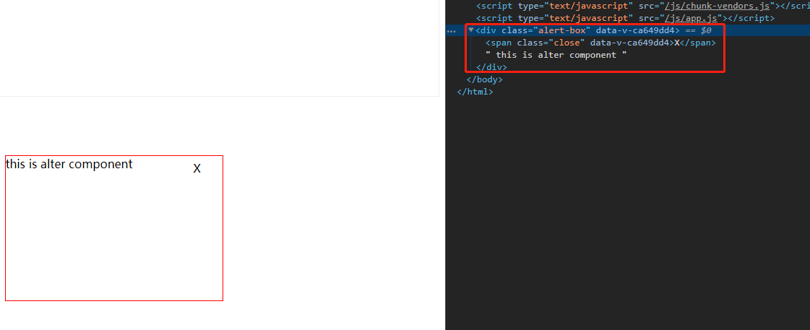

# 020-teleport

称为“传送门”组件，类似于React的`<Portal />`

## 1、场景

在vue2中，我们定义一个弹窗组件Alter.vue
```html
<div class="alert-box" v-if="isShow">
    <span class="close" @click="$emit('update:isShow', !isShow)">X</span>
    this is alter component
</div>
```

然后在父组件引用，子组件的html结构是在父组件里面，但是我们往往想要放在body上
```html
<teleport to="body">
    <div class="alert-box" v-if="isShow">
        <span class="close" @click="$emit('update:isShow', !isShow)">X</span>
        this is alter component
    </div>
</teleport>
```
vue会通过`document.querySelect()`查到上面的to指定的DOM




## 2、属性
`<teleport />`上有个属性disabled，设置为true表示禁止传送门功能，那就和普通组件一样的展示方式
```html
<teleport to="body" :disabled="true">
    ...
</teleport>
```


## 3、同时多个teleport
当同时有多个`<teleport />`的时候，会依次全部添加进入

```html
<teleport to="#box">AAA</teleport>
<teleport to="#box">BBB</teleport>
```

结果
```html
<div id="box">
  AAA
  BBB
</div>
```

## 4、特点
* 因为真实DOM接口已经脱离了父组件，所以在父组件无法捕获到`<teleport />`里面的事件冒泡

