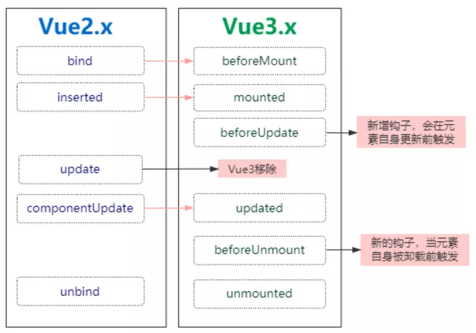

# 025-自定义指令的变化


## 1、vue2的自定义指令
在Vue 2 中， 自定义指令通过以下几个可选钩子创建：

* `bind`：只调用一次，指令第一次绑定到元素时调用。在这里可以进行一次性的初始化设置。
* `inserted`：被绑定元素插入父节点时调用 (仅保证父节点存在，但不一定已被插入文档中)。
* `update`：所在组件的 VNode 更新时调用，但是可能发生在其子 VNode 更新之前。指令的值可能发生了改变，也可能没有。但是你可以通过比较更新前后的值来忽略不必要的模板更新 (详细的钩子函数参数见下)。
* `componentUpdated`：指令所在组件的 VNode 及其子 VNode 全部更新后调用。
* `unbind`：只调用一次，指令与元素解绑时调用。

比如自定义zhiling:
```js
Vue.directive('focus', {
  // 当被绑定的元素插入到 DOM 中时……
  inserted: function (el) {
    // 聚焦元素
    el.focus()
  }
})
```

在Vue 3 中对自定义指令的 API进行了更加语义化的修改， 就如组件生命周期变更一样， 都是为了更好的语义化， 变更如下：

