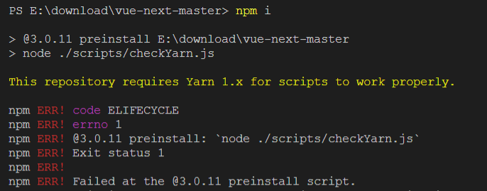

# 001-如何检查一定用yarn安装

下载[vue-next源码](https://hub.fastgit.org/vuejs/vue-next)后

使用`npm install`会出现下面提示`This repository requires Yarn 1.x for scripts to work properly.`




那么是如何实现这种效果的呢

1. 在`/scripts/checkYarn.js`里面有这么段代码
```js
if (!/yarn\.js$/.test(process.env.npm_execpath || '')) {
  console.warn(
    '\u001b[33mThis repository requires Yarn 1.x for scripts to work properly.\u001b[39m\n'
  )
  process.exit(1)
}
```
这是用node检查了下`process.env.npm_execpath`环境


2. 在`package.json`中配置下
```json
{
    "scripts": {
        "preinstall": "node ./scripts/checkYarn.js",
    }
}
```