# 003-脚手架是什么及原理


## 1、一个脚手架命令的组成
我们在cmd执行脚手架vue脚手架命令，比如
```shell
vue create my-vue-project
```
该命令表示创建一个vue项目

该命令由3部分组成，其中:
* `vue`: 称为主命令
* `create`: 称为（指令）command
* `my-vue-project`: 称为指令create的参数（parmas)

这条命令比较简单，实际中的命令更是多种多样。

比如创建vue项目时，当前目录已经有文件，我们需要覆盖当前目录文件，强制安装vue，可以执行下面命令
```shell
vue create my-vue-project --force
```
这里 `--force` 叫 `配置（option）` ，用来辅助脚手架确定特定场景下用户的选择。

配置也可以设置 `参数（param）` ，上面命令没写值说明默认是true，即`--force=true`


还有一种场景，通过`vue create`的时候，我们可以通过下面命令:
```shell
vue create my-vue-project -r=https://registry.npm.taobao.org/
```
该命令除了创建项目完，还会使用taobao源来安装包依赖

这里的 `-r` 也叫 `option` ，是`--registry`的简写，


那么怎么知道指令有哪些配置呢，我们可以执行
```shell
vue create --help
```
上面命令会打印出所支持的配置

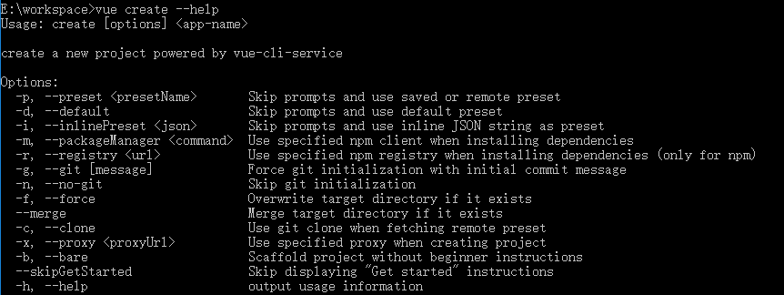

**总结:**
一个标准的脚手架命令组成部分: `vue command [options] <parmas>`


## 2、脚手架的执行原理

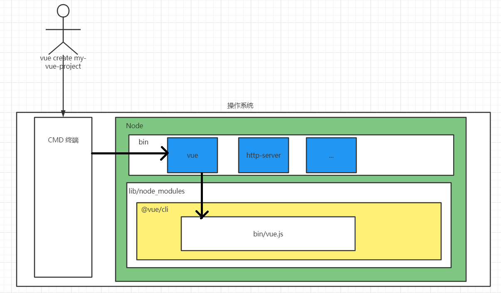


### 2.1 window查看真正执行的文件
1. 找到全局安装目录，window的用户可以执行命令
```shell
npm config get prefix
```
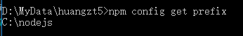

会得到了全局安装的目录，进入该目录可以看到我们已经安装好的所有全局命令

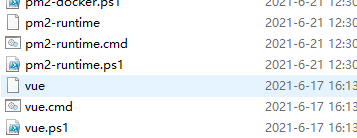

查看`vue.cmd`源码发现下面内容

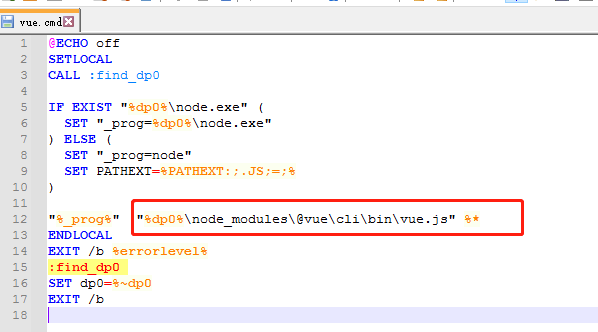

可以看出真正执行的是 `当前目录下\node_modules\@vue\cli\bin\vue.js` 这个js文件


### 2.2 linux查看真正执行的文件
linux的用户执行
```shell
npm config get prefix

```
也会得到一个全局目录

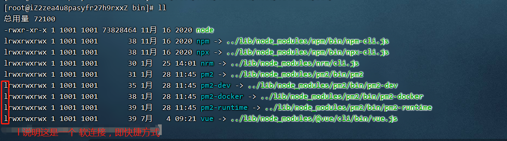

进入该目录的bin目录后可以看到所有全局命令，通过文件修饰符是`lrwxrwxrwx`说明这是一个软连接，去到真正的目录里也可以找到真正执行的js

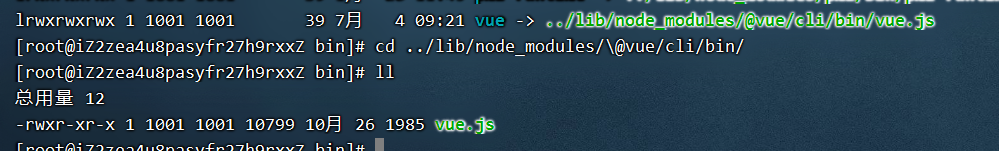

linux用户还可执行下面命令直接找到
```shell
which vue
```

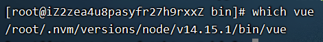


## 3、执行`npm i -g`的时候发生了什么

### 3.1 我们安装的是@vue/cli，为什么得到的是vue这个命令

我们是通过`npm i -g @vue/cli`安装脚手架的，安装完后，为什么我们得到的是`vue create`这样以 `vue` 开头的命令呢。

我们知道全局安装的命令都会在`/root/.nvm/versions/node/v14.15.1/bin/`（Linux环境）创建一个 `vue` 软连接，所以我们才能执行`vue create`这样的命令

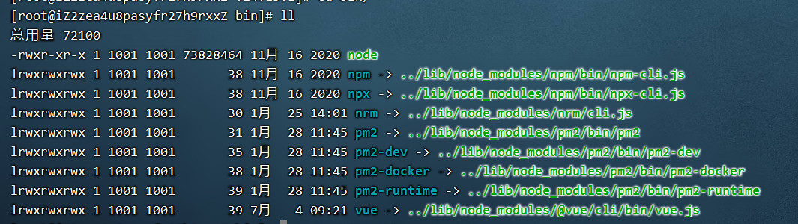

那么为什么我们执行`npm i -g @vue/cli`后，系统会帮我创建这样一天软连接，而不是创建一条`hahah create`、`xxxx create`这样的软连接呢？


跟着软连接路径，我们看下真正的目录里面的内容
```shell
cd ../lib/node_modules/\@vue/cli/

ll
```

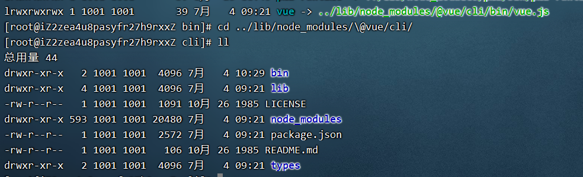

这个上面截图其实就是开发一个脚手架的项目了，在 `package.json` 里面我们可以找到这么端配置

```json
{
    "bin": {
        "vue": "bin/vue.js"
    }
}
```

那么当我们执行`npm i -g @vue/cli`的时候，到底发生了什么??

1. 当执行`npm i -g @vue/cli`的时候，npm会从npm官网上下载`@vue/cli`到我们的node环境中的全局包里面

2. 下载完后，会扫描`@vue/cli/pageage.json`里面的内容，看是否有`bin`这个关键词，有的话，就会到node环境bin目录里面创建一个软连接，指向`bin/vue.js`这个文件


### 3.2 为什么不用执行`node vue.js`
通过上面的我们知道了，执行`vue create my-vue-project`的时候，实际上就是执行了`@vue/cli/bin/vue.js`。

那么问题又来了，我们平常在cmd里面，想要执行某个js，都是通过`node xxx.js`才能执行的，为什么到了脚手架这里，我们不用`node vue create my-vue-project`这样在前面加个`node`呢？？

我们打开`@vue/cli/bin/vue.js`，看到最前面有句话
```
#!/usr/bin/env node
```
这句代码的作用，就是告诉cmd，要用什么解析器来执行代码

比如现在有个`main.js`，代码如下:
```js
#!/usr/bin/env node

console.log('haha haha');
```

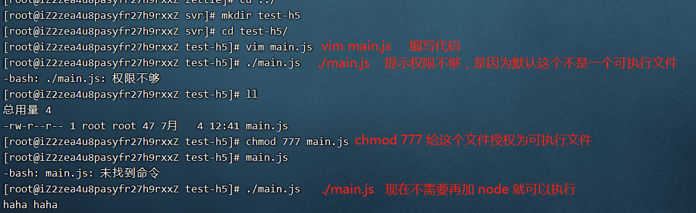

那么`#!/usr/bin/env node`这句代码是什么意思？这代码会去我们的`/usr/bin/env`中找到node命令。执行
```shell
/usr/bin/env
```
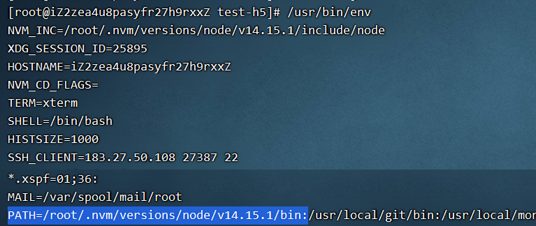

看到上面截图就是node的环境变量，所以整个链路就通了。

大家有时候会看到别人是下面的写法
```js
#!/usr/bin/node
```
上面的写法可以吗？答案是不一定可以，这个要跟电脑配置路径有关系，如果上面`/usr/bin`下面有node命令就可以，但是换了个人，他的电脑配置可能不一样，并一样这个目录里面有node，就不行了

所以不推荐上面的写法，最好用下面的，都从电脑环境变量里面去找
```js
#!/usr/bin/env node
```