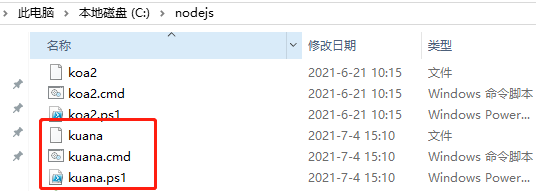
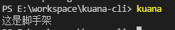
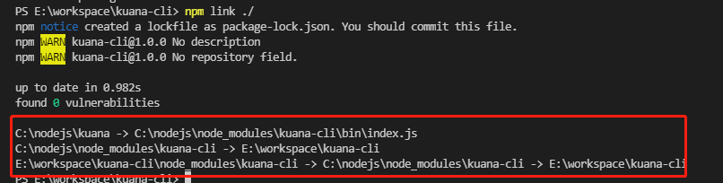
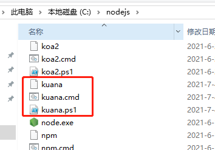
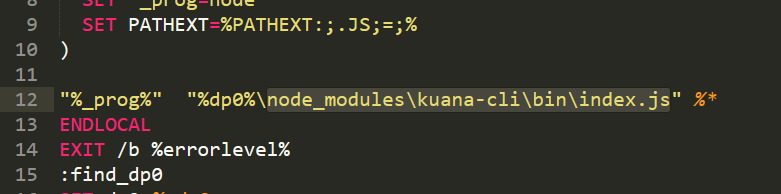
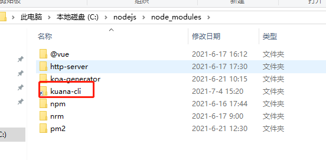
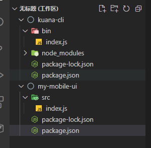

# 004-脚手架调试方法

## 1、怎么发版一个脚手架

首先要了解怎么发布一个脚手架包

1. 创建一个文件夹`kuana-cli`，起名要先去npm官网搜索下是否被其他人用了，用了则不能再起一样的名字。

结构如下
```js
kuana-cli
   |- bin
   |   |- index.js
   |- package.json
```

`/kuana-cli/bin/index.js` 内容如下:
```js
#!/usr/bin/env node
console.log('这是脚手架');
```

`/kuana-cli/package.json` 配置bin命令如下:
```json
{
	"bin": {
        "kuana": "./bin/index.js"
    }
}
```

2. 切换npm的源为官方源，这样才可以登录
```shell
nrm use npm

npm login

npm publish
```
发布之后，就可以去npm官网看到自己发布的包了

3. 执行
```shell
npm i -g kuana-cli
```

去到自己的全局命令目录里面，可以看到已经安装成功了



在cmd执行 `kuana` 即可得到下面结果



以上就是一个正式npm包的安装


## 2、怎么测试我们自己的本地包

npm发布后，通过`npm i -g xxx`安装的是已经发布的包。

那我们本地开发的时候，还没发布正式，要怎么调试我们本地包呢？

npm命令里面提供了`npm link`可以让我们方便的将本地包做个软连接到全局node_modules里面

如果是在项目里面:
```
cd E:\workspace\kuana-cli  # 进入我们的项目目录
npm link ./  # 表示当前目录做个软连接到全局node_module里面
```

如果是在项目的父级目录:
```
cd E:\workspace # 项目的父级目录
npm link kuana-cli  # 表示把当前目录下的kuana-cli做个软连接
```

无论是哪一种，执行完后会提示下面信息



现在再去我们全局node_moudle里面看到已经有该命令了



打开`kuana.cmd`看到代码里面



去当前目录下的`node_modules`就会发现是一个软连接



无论你修改哪一边的数据，另外一边也会同步修改。

这样，当我们执行`kuana`的时候，就是执行着我们本地开发的代码

当我们想要取消这个软连接的时候，通过下面方式取消

```shell
# 和普通卸载一个全局包的命令一样
npm uninstall -g kuana-cli
```

另外一种就是通过 `npm i -g` 安装。`npm i -g`命令会想先看下当前目录是否有同名的，有则不会去npm官网下载，而是创建一个软连接，效果和`npm link`一样

如果是在项目里面:
```
cd E:\workspace\kuana-cli  # 进入我们的项目目录
npm i -g ./  # 表示当前目录做个软连接到全局node_module里面
```

如果是在项目的父级目录:
```
cd E:\workspace # 项目的父级目录
npm i -g kuana-cli  # 表示把当前目录下的kuana-cli做个软连接
```


## 3、使用npm link调试2包
现在假如我们开发2个npm包，都还没有正式上线



比如上面 kuana-cli 依赖 my-mobile-cli， 以前我们就直接通过`npm i -S my-mobile-cli`安装，但是现在包还没发布，我们怎么使用呢

首先进入 my-mobile-cli 项目，将其设置为全局的包
```shell
cd E:\workspace\my-mobile-ui
npm link
```
这样就会有一个软连接到全局的node_module里面了

接着进入 kuana-cli，执行下面命令
```shell
npm link my-mobile-cli
```
npm会去全局里面看是否有 my-mobile-cli 这个包，找到了就再创建一个软连接到 `kuana-cli/node_modules` 里面

那么在 my-mobile-cli 这个包里面就可以直接使用了
```js
const name = require('my-mobile-ui');
console.log(name);
```

