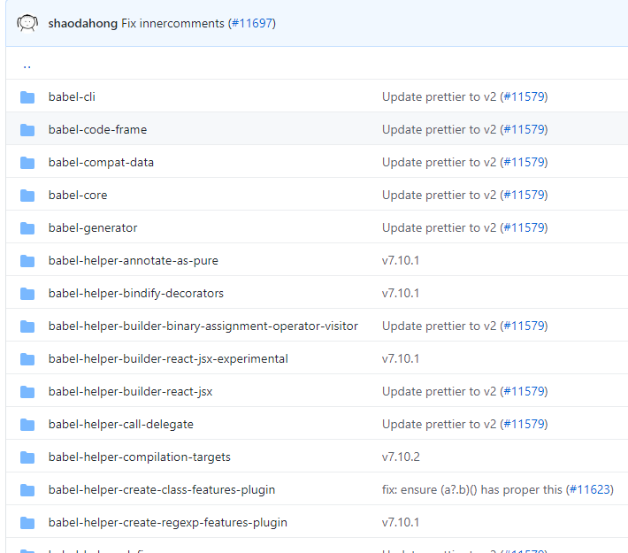
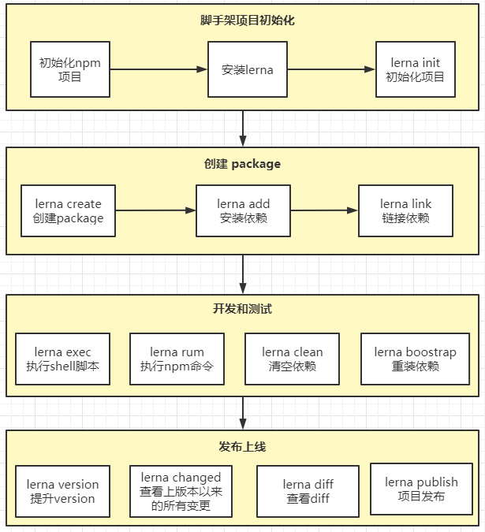
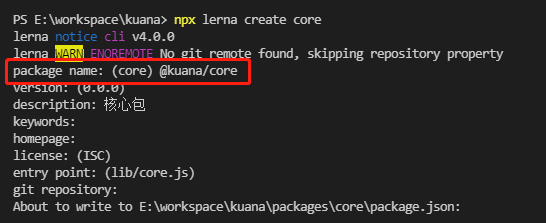
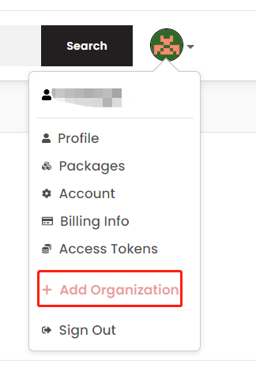
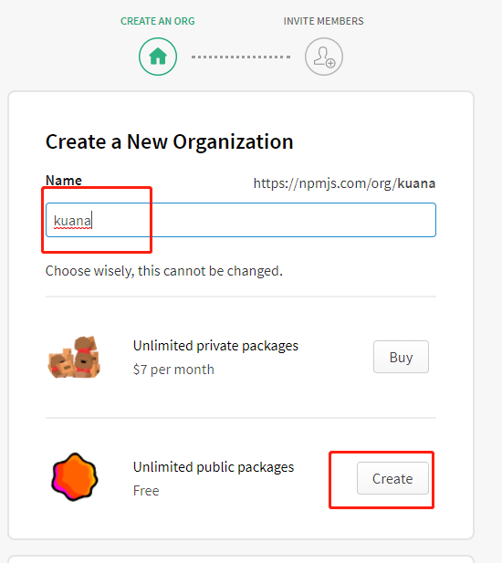
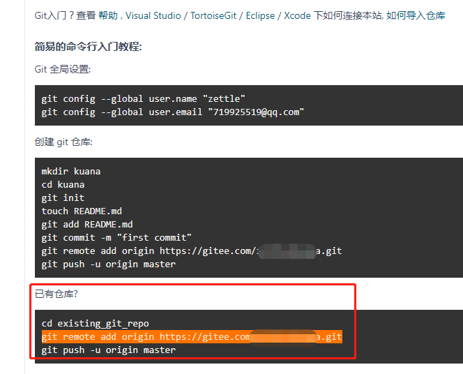
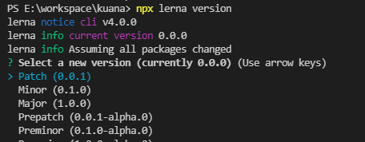
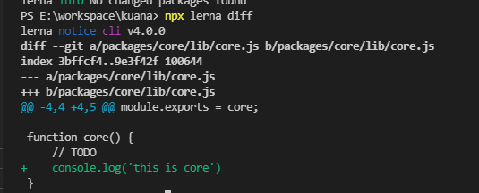
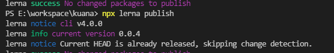
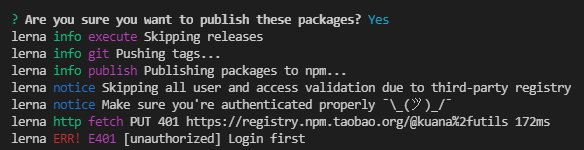

# 005-lerna管理项目


## 1、多项目的特点
我们最常用的[vue-cli](https://hub.fastgit.org/vuejs/vue-cli)、[create-react-app](https://hub.fastgit.org/facebook/create-react-app)、[babel](https://hub.fastgit.org/babel/babel/tree/6.x) 都是用lerna来管理项目

那么lerna到底解决了我们项目什么问题，拿babel来说，看下 [babel/packages](https://hub.fastgit.org/babel/babel/tree/master/packages) 目录里面的，已经有的项目就有差不多20个



* 如果这么多个包，我们要自己执行`npm link`，自己管理里面的依赖
* 当一个依赖升级，发布npm的时候要屡清里面的依赖关系。


## 2、lerna
lerna是一个优化基于git+npm的多packages项目的管理工具


### 2.1 lerna开发脚手架的流程
在整个开发过程中，lerna分别负责不同的任务，具体流程如下:




### 2.2 lerna开发脚手架

1. 首先创建一个文件夹做总项目文件，比如`kuana`，执行
```shell
# 初始化
npm init -y

# 安装lerna
npm i -D lerna

# 查看lerna版本号
npx lerna -v

# lerna初始化，会创建packages和lerna.json
npx lerna init
```
此时的文件结构如下
```
kuana
  ├─ packages
  ├─ lerna.json
  └─ package.json
```

``内容如下
```json
{
    "packages": [
        "packages/*"  // 管理的包所在的位置
    ],
    "version": "0.0.0" // 当前的版本号
}
```
后面所有增加的包都放在`/kuana/packages`里面。


2. 创建各种包
```shell
# 创建核心的包
npx lerna create core

# 创建工具库
npx lerna create utils
```
创建包的时候，会询问 `包名 package name` 这一点要注意下，lerna默认是以`lerna create xxxx`的`xxxx`作为包名的

但是我们要做的是一个集群包，所以我们自己要命名好`@kuana/core`



其中`@kuana/core`和`@kuana/utils`中的`@kuana`在npm官网中叫做组织


3. npm上创建组织
现在我们代码里面已经有组织了，但是npm上需要我们自己去创建对应的组织





创建的组织要和我们代码里面的包保持一致才可以


4. 添加依赖
加入我们的`/packages/core`项目和`/packages/utils`项目都需要用到jquery的库，那么只要执行下面命令
```shell
npx lerna add jquery
```
lerna会自动为 `/packages/*` 里面所有的项目都加上这个依赖

如果想要为某个包添加依赖，则执行下面
```shell
# 为 packages/utils 这个项目添加vue依赖
npx lerna add vue packages/utils
```

总结: `npx lerna add [npm包] [自己的项目包路径]`


5. 安装依赖
一般我们拿到一个项目之后就会执行`npm i`去安装项目所需的依赖。

而在集群包中，我们如果要每个项目都安装，需要去每个包项目中一个个执行`npm i`。

而`lerna bootstrap`则是用来代替上面的手工操作的

```shell
# 根据每个项目的package.json安装依赖
npx lerna bootstrap
```


6. 删除依赖
```shell
npx lerna clean
```
注意这条命令，是删除各个包里面的`node_modules`文件夹而已，但是包里面的`package.json`的`dependencies/devdependencies`还是会有

可以理解这个是代替我们手动删除`node_modules`


7. 包项目互相依赖

当我们的包之间有相互依赖的时候，比如上面`@kuana/core`依赖`@kuana/utils`里面的方法。

在以前我们就通过`npm link`创建快捷方式解决本地调试的问题。

而lerna提供了`lerna link`

首先我们需要去修改`@kuana/core`的`package.json`的`dependencies/devDependencies`，显性的声明下`@kuana/utils`的依赖
```json
{
	"dependencies": {
		"@kuana/utils": "^0.0.1"  # 注意这里的包名和版本要和本地的`@kuana/utils` name和version一致
  }
}
```
然后到根目录，执行`npx lerna link`，lerna会动根据每个项目的`package.json`自动创建项目所需的快捷方式


8. 执行shell命令
比如现在有这么个场景，想要在所有包中执行某条shell命令。

格式: `npx lerna exec -- [shell命令]`

```shell
# 输出 haha
npx lerna exec -- echo 'haha'

# 删除node_modules
npx lerna exec -- rm -rf ./node_modules
```
注意执行shell的时候，跟目录会变成每个包，可以这么理解，lerna会自动进入每个包后，再执行shell脚本

格式: `npx lerna exec --scope [包名] -- [shell命令]` 这个是只在指定的包名中执行shell命令

```shell
npx lerna exec --scope @kuana/core -- echo 23
```
注意这里的`[包名]`要是对应包的`packeage.json`的name（即我们将来要发布的包名）


9. 执行npm命令
格式: `npx lerna run [npm命令名称]`

比如上面的 `@kuana/core` 和 `@kuana/utils` 都有下面的npm命令
```json
"scripts": {
    "dev": "echo \"this is dev\""
  }
```
现在想要在每个项目中执行，name只需要执行
```shell
npx lerna run dev
```
lerna就会去每个组件中找有没有`dev`这条命令，有的话就会执行


参数`--scope`: `npx lerna --scope [包名] run [npm命令名称]`。比如:
```shell
# 只在@kuana/core中执行npm run dev
npx lerna --scope @kuana/core run dev
```

参数`--npm-client`: 用`npm/cnpm/yarn`来执行命令
```shell
lerna run build --npm-client=yarn
```


2. 关联git

创建`.gitignore`文件，将下面文件列入忽略清单
```
node_modules

packages/**/node_modules
```

执行下面命令:
```shell
git add .

git commit -am 'init'
```

到`github/gitee`上创建一个仓库



执行
```shell
git remote add origin https://gitee.com/xxx/kuana.git
git push -u origin master
```


3. 发布

发布之前，我们需要对我们本地的项目包做一次版本号的升级

执行 `npx lerna version`，会打印出当前的版本号，并让我们选择要升级到什么版本



选择版本后，会询问`? Are you sure you want to create these versions?`如果选择 `Y`。就会push代码到仓库

执行`npx lerna diff`可以查看这次commit和上次commit之间的差异



提升完版本号后，就可以发布了，执行`npx lerna publish`，会再一次让你选择版本号，然后发布

遇到的问题:
> 1. 提示内容没有更新



执行完`npx lerna version`提升版本后，立即执行`npx lerna publish`会提示内容没有变更，这个时候去随便修改点东西即可


> 2. 缺少`LICENSE.md`

执行`npx lerna publish`提示`Packages @kuana/core and @kuana/utils are missing a license.`说明缺少一个声明文件，在根目录创建`LICENSE.md`即可

或者执行`npm set init-license  ISC`

> 3. 提示`fetch PUT 401 https://registry.npm.taobao.org/@kuana%2futils 172ms` 



把项目所有package.josn中的
```
"publishConfig": {
  "registry": "https://registry.npm.taobao.org/"
},

// 改为下面
"publishConfig": {
    "access": "public"
}
```