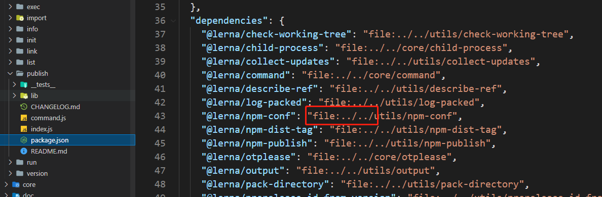
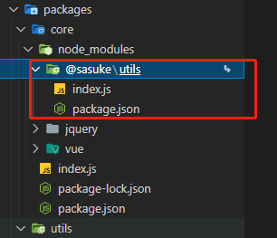
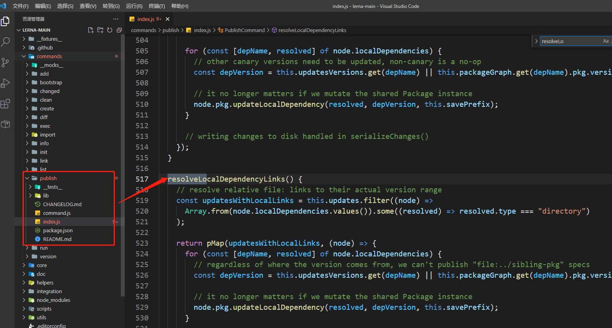

# 006-比link好的本地调试

在前面介绍了lerna工具的`link`命令可以帮我们解决开发过程的包依赖问题

查看Jerna源码，可以看到Jerna采用的是在`package.json - dependencies`上采用的是另外一种方式



这种是npm的全新方式，下面弄个简单的demo试下

## 1、file引入包依赖
现在有个项目`sasuke`，结构如下:
```
sasuke
  ├─ core
  │    ├─ index.js
  │    └─ package.json
  └─ utils
       ├─ index.js
	   └─ package.json
```
其中`core/index.js`依赖`utils/index.js`，代码如下:
```js
const utils = require('@sasuke/utils');
utils();
```
那么怎么才能让node知道`require('@sasuke/utils')`的是`/utils`这个文件夹呢？

我们在`/core/package.json`中手动新增下面依赖
```json
{
	"devDependencies": {
		"@sasuke/utils": "file:../utils"
	}
}
```

然后在`/core`执行`npm i`，npm检查到这里的包是file，就会自动创建对应的软连接




## 2、如何解决发布时的file问题
当我们发布到npm包上的时候，这些file路径都需要解决的，Lerna是怎么解决的呢？

Lerna在发布的时候，会执行下面命令，将上面的`file路径`替换为平常的包依赖

