# 007-yargs工具介绍

[yargs](https://www.npmjs.com/package/yargs)是一款很好用的解析命名行参数的工具

lerna底层就是基于yargs封装的，详见[learn源码](https://hub.fastgit.org/lerna/lerna) 的 [core/global-options模块](https://hub.fastgit.org/lerna/lerna/blob/main/core/global-options/index.js) 和 [core/cli模块](https://hub.fastgit.org/lerna/lerna/blob/main/core/cli/index.js)

要看懂lerna，就需要先知道yargs用法，如果自己封装脚手架，也需要会yargs的用法


## 1、初始化项目

现有一个项目如下
```
yargs-learn
  ├─ bin
  │   └─ index.js
  └─ package.json
```

1. `package.json`配置 `yalearn`命令
```json
{
  "bin": {
    "yalearn": "bin/index.js"
  }
}
```

2. `/bin/index.js`内容如下:
```js
#!/usr/bin/env node
console.log(23);
```

3. 创建全局link方便调试，执行`npm link`。可以在全局node_modules中看到`yalearn`

执行`yalearn`看到下面结果说明link成功

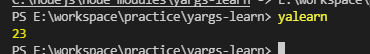

那么接下来就是用yargs来解析各种命令了


## 2、yargs的基本使用

安装`npm i yargs`

1. 修改`/bind/index.js`内容如下:
```js
#!/usr/bin/env node
const yargs = require('yargs/yargs');
const { hideBin } = require('yargs/helpers');

const arg = hideBin(process.argv);
yargs(arg)
  .argv;
```
yargs默认会加上一个`--help`，所以此时执行`yalearn --help`可以看到下面内容

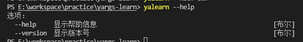


### 2.1 strict
开启严格模式，当我们执行`yalearn -aaa`的时候，并没有配置`--aaa`的时候，如果执行`yalearn --aaa`，命令行也不会报错

而当我们给yargs加上`strict()`后，就会提示`--aaa`不存在

```js
// /bin/index.js 内容如下

yargs(arg)
  .strict()
  .argv;
```
执行`yalearn -aaa`前后效果对比

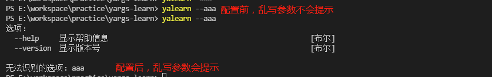


### 2.2 usage
`usage()`定义命令行的头部文案

```js
// /bin/index.js 内容如下

yargs(arg)
  .usage('帮助文档: $0 <command> [options]')
  .argv;
```

这样，在执行`yalearn --help`的时候，就会出现下面提示

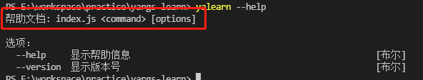


### 2.3 demandCommand
`demandCommand(数量, 提示)` 用来设置当用户执行命令的时候，至少需要多少条command，如果少于这里设置的，就会提示`--aaa`不存在

```js
// /bin/index.js 内容如下

yargs(arg)
  .demandCommand(1, '最少需要1个command命令，执行--help查看帮助手册')
  .argv;
```

但我们直接执行 `yalearn` 不带任何command的时候，就会出现下面提示

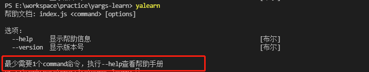

对应的，也有`demandOption()`这个设置至少需要多少个option参数


### 2.4 alias
`alias(别名, 原始名)`这个是为命令起别名

```js
// /bin/index.js 内容如下

yargs(arg)
    .alias('a', 'help')
    .alias('v', 'version')
    .argv;
```

在执行`yalearn --help`可以看到每条命令前面都有我们配置的别名

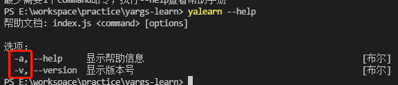


### 2.5 wrap
`wrap(数字)`设置命令行占的宽度列数

```js
// /bin/index.js 内容如下

yargs(arg)
  .wrap(300)
  .argv;
```

执行`yalearn --help`看到下面效果对比

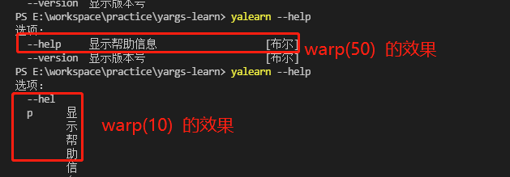

如果想要设置成整个命令行窗口的宽度，则可以可以用下面方法
```js
// bin/index.js 内容如下

const cli = yargs(arg);
cli
  .wrap(cli.terminalWidth())
  .argv;
```


### 2.6 epilogue
`epilogue(文案)`设置结尾文案

```js
// bin/index.js 内容如下

yargs(arg)
  .epilogue('这是结尾文案')
  .argv;
```

执行`yalearn --help`看到下面结果

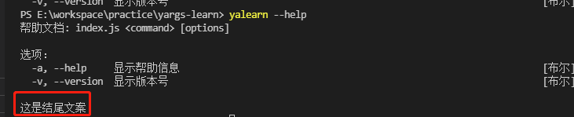

在lerna源码中，我们可以看到还用了 [dedent](https://www.npmjs.com/package/dedent) 这个库和`epilogue()`一起使用，是达到什么效果呢?

我们知道，在es6中的模板字符串可以让我们轻松写个换行的字符串
```js
// bin/index.js 内容如下

yargs(arg)
  .epilogue(`
    这是结尾文案11
    这是结尾文案22
  `)
  .argv;
```
这种输出，会在文案前面留着空格出来，如下图所示:

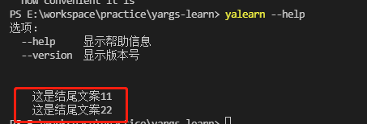

而 dedent 就是解决这个问题的，会自动帮我们去掉文案的空格

```js
// bin/index.js 内容如下

yargs(arg)
  .epilogue(dedent(`
    这是结尾文案11
    这是结尾文案22
      * 好好学习
  `))
  .argv;
```
输出结果如下所示:

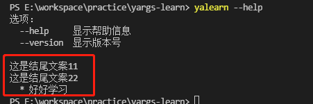


### 2.7 options
`options(配置集合)`设置全局的一些options配置，每一项options支持下面配置
* `describe`: 对配置的文案说明
* `type`: 表示该配置参数格式的说明，支持的有`boolean/string/number`
* `alias`: 该命令的别名
* `requiresArg`: 布尔型
* `hidden`: 布尔型，true表示当执行`--help`的是否不会展示
* ``: 
* ``: 
* ``: 
* ``: 

```js
yargs(arg)
  .options({
    loglevel: {
      defaultDescription: 'info',
	  describe: "日志级别",
	  type: "string",
	  alias: 'l',
	  requiresArg: true
	}
  })
```

对应的 `option(名字, 配置)` 效果和 `options(配置集合)` 是一样的，不同的是前者只能配置一条，后者可以配置多条

比如下面代码是等效的:
```js
yargs(arg).options({
  loglevel: {
    type: "string"
  }
});
// 等效下面
yargs(arg).option('loglevel', {
  type: "string"
});
```


### 2.8 group
`group(哪些options, 分类名)`主要是将我们的options配置进行下分类

```js
yargs(arg)
  .options({
    loglevel: { describe: "日志级别", type: "string" },
	force: { type: 'boolean' }
  })
  .group(['loglevel'], '有关调试的配置')
  .group(['force'], '有关强制的配置')
  .argv;
```
这样，当查看帮助手册的时候，就会帮我们分类展示

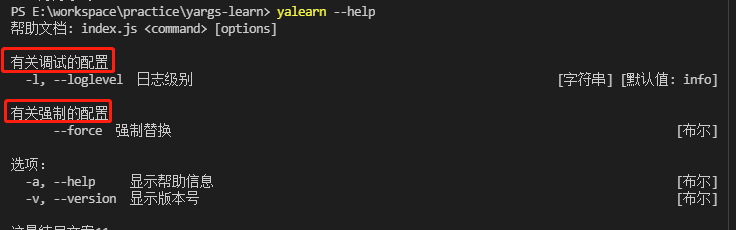


### 2.9 command
`command(命令文案, 命令描述, 配置方法, 执行方法)`该命令是来配置command命令的

比如下面命令:
```js
yargs(arg)
  .command('create [项目名]', '创建项目', (yargs) => {
	yargs.option('name', { describe: '项目名称' });
  }, (argv) => {
	console.log('node开始处理，得到的参数', argv);
  });
```
执行`yalearn create --help`可以查看下面效果

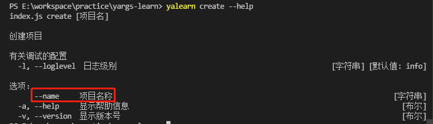

当我们执行`yalearn create --name=myProject`的时候，`--name`参数就会传递进去了

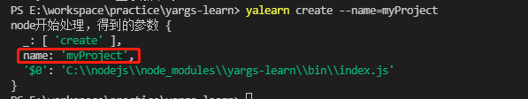

注意: 当我们设置了别名的时候，别名也会一并传递进去
```js
yargs(arg)
  .command('create [项目名]', '创建项目', (yargs) => {
	yargs.option('name', { 
      alias:'n',   // 设置了别名
	  describe: '项目名称' 
	});
  }, (argv) => {
	console.log('node开始处理，得到的参数', argv);
  });
```
当执行`yalearn create --name=myProject`的时候，得到参数如下:
```js
{
  _: [ 'create' ],
  name: 'myProject',
  n: 'myProject', // 别名也来了
  '$0': 'C:\\nodejs\\node_modules\\yargs-learn\\bin\\index.js'
}
```
对于options参数的传递，除了用`=`还可以用空格，比如`yalearn create --name=myProject -d -r taobao`，name得到参数
```js
{
  _: [ 'create' ],
  name: 'myProject',
  n: 'myProject',
  d: true,
  r: 'taobao',
  '$0': 'C:\\nodejs\\node_modules\\yargs-learn\\bin\\index.js'
}
```

除了`command(命令文案, 命令描述, 配置方法, 执行方法)`这种传参方式，还支持传入一个对象`command({...})`

对应的key如下:

* `command`: command命令名，等于上面的第1个参数
* `aliases`: 接收一个数组，给command命令起别名（注意command的起别名是aliases，而options的起别名是alias）
* `describe`: 该command的描述文案，等于上面的第2个参数
* `builder`: 接收一个函数，等于上面的第3个参数
* `handler`: 接收一个函数，等于上面的第4个参数
```js
yargs(arg)
  .command('create [项目名]', '创建项目', (yargs) => {
	yargs.option('name', { 
      alias:'n',   // 设置了别名
	  describe: '项目名称' 
	});
  }, (argv) => {
	console.log('node开始处理，得到的参数', argv);
  });
  
// 和下面是等效的
yargs(arg)
  .command({
  command: 'create',
  aliases: ['c', 'cr'], //起别名
  describe: '创建项目',
  builder: (yargs) => {
	yargs.option('name', {alias:'n',describe:'项目名称'})
  },
  handler: (argv) => {
	console.log('node开始处理，得到的参数', argv);
  }
})
```


### 2.10 recommendCommands
`recommendCommands()`的用法很简单，配置后，当用户输入的command命令匹配不多，会自动提示用户是否是要输入匹配中的另外一条

比如我们配置 `yalearn create` 和 `yalearn list` 命令如下:
```js
yargs(arg)
  .recommendCommands()
  .command('create [项目名]', '创建项目', (yargs) => {}, (argv) => {console.log('执行create')})
  .command('list', '创建项目', (yargs) => {}, (argv) => {console.log('执行list')})
  .argv;
```
当用户执行的command命令匹配不上，比如执行`yalearn lis`，会出现友好提示

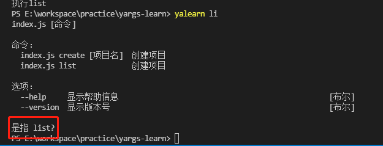


### 2.11 fail
`fail(处理函数)`当执行的command命令不存在的时候会触发该回调

```js
yargs(arg)
  .fail((err, msg) => {
	console.log('fail', err, msg);
  })
  .argv;
```


### 2.12 parse
`parse(数组, json)`可以提供公共的一些参数给所有的command

使用`parse(数组, json)`的时候，需要对代码改造下

```js
// 原代码
const arg = hideBin(process.argv);
yargs(arg)
  .command('create [name]', '创建项目', (yargs) => {
	yargs.option('name', {describe:'项目名称', type: 'string'})
  }, (argv) => {
	console.log('node，参数', argv);
  })
  .argv;
```
改为:
```js
const arg = hideBin(process.argv);
const argv = process.argv.slice(2);

yargs(arg)
  .command('create [name]', '创建项目', (yargs) => {
	yargs.option('name', {describe:'项目名称', type: 'string'})
  }, (argv) => {
	console.log('node，参数', argv);
  })
  .parse(argv, { age: 223 });
```


