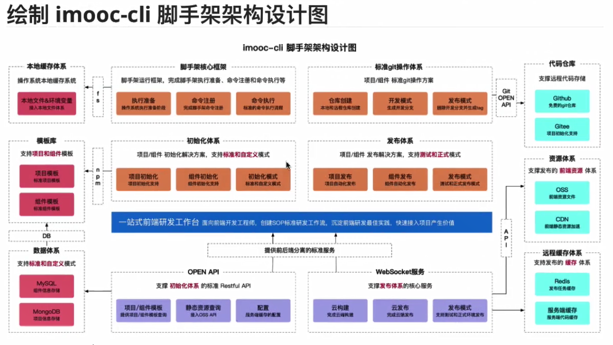
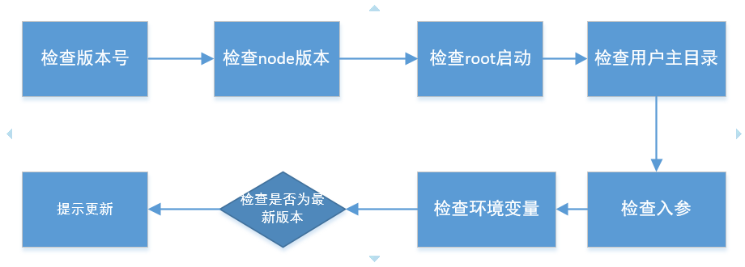

# 008-脚手架设计

## 1、脚手架的设计图

## 2、脚手架拆包策略
* 核心流程core
* 命令commands
	* 初始化
	* 发布
	* 清除缓存
* 模型层models
	* command命令
	* project项目
	* component组件
	* npm模块
	* git仓库
* 支撑模块utils
	* Git操作
	* 云构建
	* 工具方法
	* API请求

## 3、core模块技术方案
### 3.1 准备阶段

1. 检查下脚手架当前版本号是否正常的版本号
2. 检查node版本，防止我们使用高级api，而用户电脑node版本低
3. 检查root启动，如果用户是root用户，使用我们脚手架创建文件、文件夹等的操作，其他角色用户是不能对其文件进行修改的。为了避免这种问题，我们检查下是否root，将root降级
4. 检查用户是否有主目录
5. 检查入参
6. 检查环境变量

涉及到的第3方库:
* import-local: 优先执行本地的命令
* commander: 使用commander创建命令
* npmlog: 打印日志
* fs-extra: 基于fs封装了很多文件操作
* semver: 版本比对，当前版本是否为最新版本
* colors: 在cmd打印不同颜色文字
* user-home: 快速获取用户主目录
* dotenv: 获取环境变量
* root-check: root用户的检查和降级