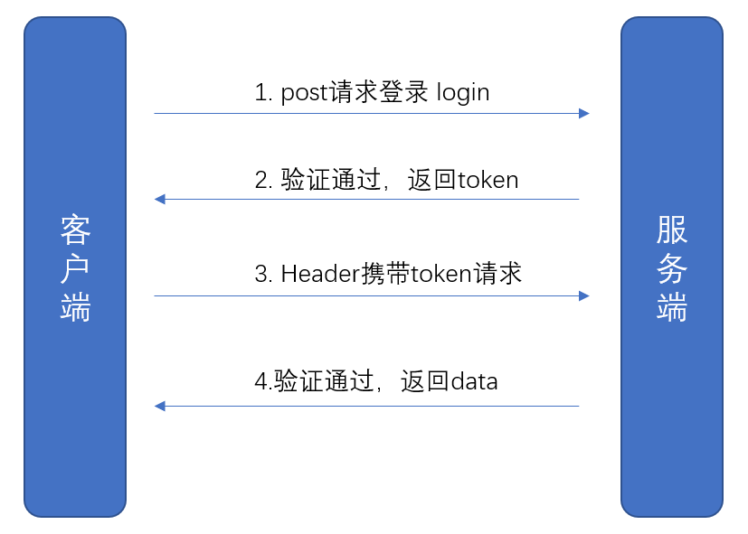
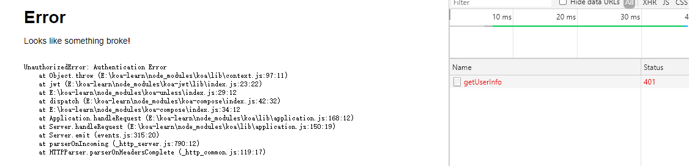

# JWT

一个介绍[JWT](https://jwt.io/#decoded-jwt)的网站

## 1、JWT的工作原理




## 2、JWT的结构
JWT由3个部分组成，分别是`Header/Payload/Signature`，由这3个部分组合成一个token，比如``

* `Header`部分: 主要规定了token使用的加密方式以及token的运行,比如
```js
{
    alg: 'HS256',
    typ: 'JWT'
}
```
* `Payload`部分: 主要是用户的一些信息，比如用户名、过期时间等，比如:
```js
{
    sub: '2019-09-12',
    name: '小明',
    admin: true
}
```

* `Signature`部分: 由下面计算而得
```js
HMACSHA256(
    base64UrlEncode(header) + '.' +
    base64UrlEncode(payload),
    secret
)
```


## 3、koa集成JWT
安装对应的npm包: `npm i koa-jwt jsonwebtoken`
* `koa-jwt`: 主要负责的是对请求的拦截，比如约定哪些请求不需要JWT校验，检验tokoen是否正确，校验失败的处理
* `jsonwebtoken`: 主要负责JWT的token生成

### 3.1 集成koa-jwt，约定哪些请求要鉴权
```js
const Koa = require('koa');
const jwt = require('koa-jwt');

const app = new Koa();
// secret为随机字符串
// unless.path配置不需要jwt校验的路径，支持正则，像下面表示以 `localhost:3000`和 `localhost:3000/login`不需要鉴权
app.use(jwt({ secret: 'suijisuiji' }).unless({ path: [/^\/$/, /^\/login/] }));
```

请求`http://localhost:3000/login`正常，访问`http://localhost:3000/getUserInfo`提示401




**自定义错误提示**

上面截图是koa-jwt默认提示页面，如果我们想要自定义错误提示，可以这么处理
```js
// 要放在 app.use(jwt({ secret: 'suijisuiji' }) 之前
app.use(function(ctx, next){
  return next().catch((err) => {
    if (401 == err.status) {
      ctx.status = 401;
      ctx.body = {
        code: -9999,
        msg: 'token校验失败'
      };
    } else {
      throw err;
    }
  });
});

app.use(jwt({ secret: 'suijisuiji' }).unless({ path: [/^\/$/, /^\/login/] }));
```
异常处理要放在`app.use(jwt())`之前才能生效


### 3.2 登录接口集成jsonwebtoken

比如登录接口，在用户名+密码验证通过后，我们就生成一个token
```js
router.post('/login', async (ctx, next) => {
  const token =jsonwebtoken.sign({ username:'xiaoming' }, 'suijisuiji', {expiresIn: '1d'});

  ctx.body = {
    code: 0,
    data: {
      token
    }
  }
})
```
上面的 `suijisuiji` 需要和 `jwt({ secret: 'suijisuiji' })` 的字符串保持一致，这样才能验证通过

> 上面是通过第3个参数设置`{expiresIn: '1d'}`来设置1天有效期，也可以在第1个参数设置`{ username:'xiaoming', exp: Math.floor(Date.now()/1000)+60*60*24 }`效果是一样，但是不能2边都设置


### 3.3 前端的处理
先请求登录接口，获取到token，然后后面的接口要往headers设置`{Authorization: 'Bearer ' + token}`
```js
$.post('/login', {name:'xiaming',password:'123456'}).then(res => {
  const token = res.data.token;
  $.ajax({
    type: 'POST',
    url: '/getUserInfo',
    headers:{
      "Authorization": 'Bearer ' + token
    },
    success: function(data, status, xhr){
      console.log(data);
    }
  });
});
```

> 注意: `Bearer `不能省不能改，`Bearer`和token之间有个空格

在headers携带Authorization给接口，koa-jwt就会去验证是否正确，正确才会返回数据