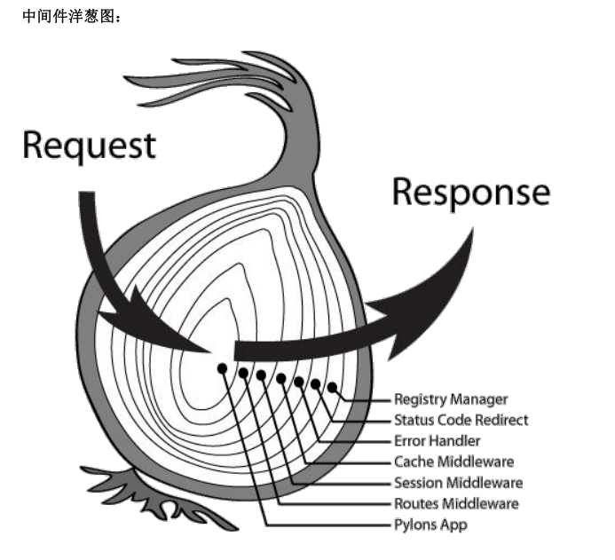

# 002-中间件

## 1、中间件的执行顺序
和express的不同，koa中间件即使写在路由后面，也会先匹配先执行
```js
router.get('/', (ctx, next) => {
    console.log('这是首页路由');
    ctx.body = '这是首页'
});

// 即使中间件放在后面也会先执行
app.use(async (ctx, next) => {
    console.log('这是第一个中间件');
    next();
});
```
当访问时候，上面执行结果
```
这是第一个中间件
这是首页路由
```

但有多个中间件的时候，中间件总是会优先执行：`应用级中间件-路由级中间件`
```js
// 第1个执行
app.use(async (ctx, next) => {
    console.log('这是第1个中间件');
    next();
});

// 第3个执行
router.get('/', (ctx, next) => {
    console.log('这是首页路由');
    ctx.body = '这是首页'
});

// 第2个执行
app.use(async (ctx, next) => {
    console.log('这是第2个中间件');
    next();
});
```
上面执行结果如下：
```
这是第1个中间件
这是第2个中间件
这是首页路由
```

但中间件中next后面还有代码的时候，koa会在执行完路由之后回头再继续执行中间件next后面的代码
```js
// 第1个执行
app.use(async (ctx, next) => {
    console.log('这是第1个中间件');
    next();
    console.log('这是第1个next后面的');
});

// 第3个执行
router.get('/', (ctx, next) => {
    console.log('这是首页路由');
    ctx.body = '这是首页'
});

// 第2个执行
app.use(async (ctx, next) => {
    console.log('这是第2个中间件');
    next();
    console.log('这是第2个next后面的');
});
```
上面执行结果
```
这是第1个中间件
这是第2个中间件
这是首页路由
这是第2个next后面的
这是第1个next后面的
```
执行过程:

* 首先执行`console.log('这是第1个中间件');`，然后执行`next()`跳到下面的中间件
* 执行`console.log('这是第2个中间件')`，然后执行`next()`，后面没有中间件了，就会进入匹配到的路由`/`。
* 然后再回到第2个中间件next后面的`console.log('这是第2个next后面的')`。
* 接着再回到第1个中间件next后面的`console.log('这是第1个next后面的')`

这种就像洋葱一样，如下图




## 2、自定义一个中间件
新建`/middleware/pv.js`作为一个中间件，代码如下:
```js
function pv (ctx) {
    console.log('打印访问', ctx.url);
}

module.exports = function () {
    return async function (ctx, next) {
        pv(ctx);

        await next();
    }
};
```
中间件的本质就是一个函数

然后在app.js中就可以使用这个中间件了
```js
const pv = require('./middleware/pv');

app.use(pv());
```