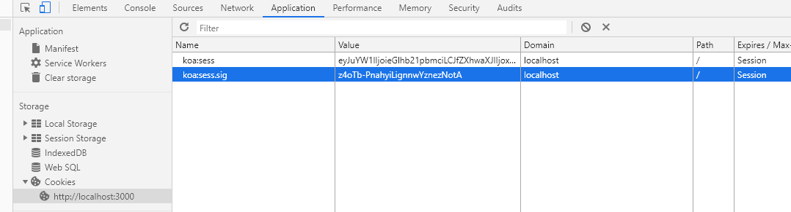
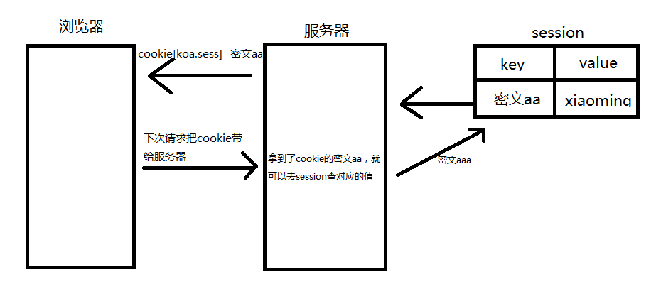
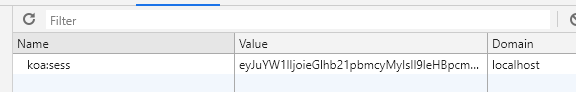
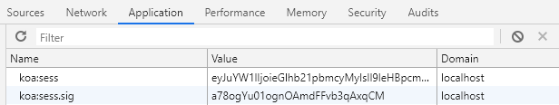

# 005-session

## 1、session的使用
安装：`npm install koa-session --save`

使用：
```js
const session = require('koa-session');

// 配置中间件
// app.keys 通过任意字符串为基准进行加密算法的字符串，当session配置的signed为true时候必须要用app.keys
app.keys = ['some secret hurr'];
const CONFIG = {};
app.use(session(CONFIG, app));

router.get('/', async (ctx, next) => {
    ctx.session.name = 'xiaoming';
    ctx.body = '首页';
});

router.get('/news', async (ctx, next) => {
    console.log('news页', ctx.session.name);
    ctx.body = 'news页';
});
```
先返回`/`页面，存储session，然后访问`/news`页面，获取session。

session的特点，浏览器一关闭就会消失。本质上，session会给浏览器一个cookie，这个cookie的值为一串密文，每次浏览器访问带着这个密文过来，session就可以拿到对应的value值。如下图



流程图：




### 1.1 session的配置项

配置项 | 说明 | 例子 |
:-: | :-: | :-:
key  | 默认'koa:sess'，session生成cookie的key，比如设置成'finance'，就会给浏览器传递一个`cookie.fin=密文`的cookie | key: 'finan' |
maxAge | 多少毫秒后过期，单位毫秒 | maxAge: 6 * 1000 |
overwrite | 默认true，是否可以覆盖，实际设为true或者false都会覆盖，很少用 | overwrite:false |
httpOnly | 默认true，true表示只有服务器才可以获取 | httpOnly:false |
signed | 默认true，设为true后会有2个cookie，一个和config.key保持一致，一个key=config.key+`.sig` | signed: false |
rolling | 默认false，true表示每次请求都重置cookie过期时间 | rolling:false |
renew | 默认false，true表示session快过期的时候如果有请求，则重置这个过期时间 |

配置项signed设置false的效果：


配置项signed设置true的效果：


singed主要作用是为了安全，为session多加了一个数字签书的信息，服务器会校验是否被修改过

配置项rolling和renew的作用差不多，主要用在下面的场景，比如用户登录后，我们设置60分钟没有操作就认为要退出登录，那么这个60分钟是在每次操作后重新开始计时的。主要区别在于rolling是在每次请求就重置，而renew则是每次请求看下session快过期了没，快过期了就重置，还早着就不充值。


## 2、 session搭redis的使用

详见redis章节的
