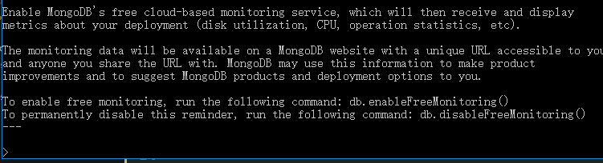
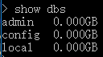
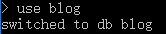
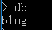
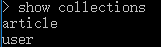
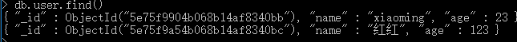

# 006-命令-数据库

通过`mongod`启动服务后，在cmd执行`mongo`即可进入mongodb的控制台如下：




## 1、查看有哪些数据库
```shell
show dbs
```



## 2、进入某个数据库
比如进入一个blog数据库: `use blog`。就算数据库不存在也可以使用



有时候进入后忘记自己是在哪个数据库了，可以通过`db`查看自己目前处于哪个数据库




## 3、查看库有哪些集合
即进入某个表：`show collections`




## 4、查看某个集合的具体数据
比如查看user集合(即user表)有哪些数据：`db.user.find()`

