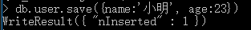
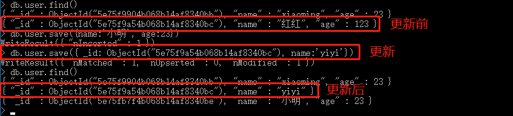
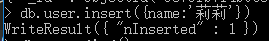
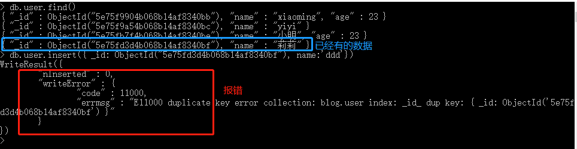

# 007-命令-新增

新增的命令有2个：`save`和`insert`

## 1、save命令
格式：`db.表名.save({数据})`

比如给user这个表加上数据：`db.user.save({name:'小明', age:23})`。新增成功后，mongodb会自动给数据加上一个`_id`的字段

save除了保存功能外，还能带有更新功能，此时参数需要带上具体的`_id`。

比如更新上面`_id: ObjectId("5e75f9a54b068b14af8340bc")`的数据，把name改为yiyi。命令：`db.user.save({ _id: ObjectId("5e75f9a54b068b14af8340bc"), name:'yiyi'})`。会把整条数据都更新成传入的值，这种更新会把多余的字段删除

## 2、insert命令
格式：`db.表名.insert({数据})`

比如给user表插入一条`{name:'莉莉'}`的数据：`db.user.insert({name:'莉莉'})`

insert是纯插入命令，当参数带上`_id`想要和save一样更新数据的，会报错

> 总结： save和insert的区别，当都是不带id表示新增的时候，没有区别。当带了id的时候，save表示更新数据，而insert则会报错
