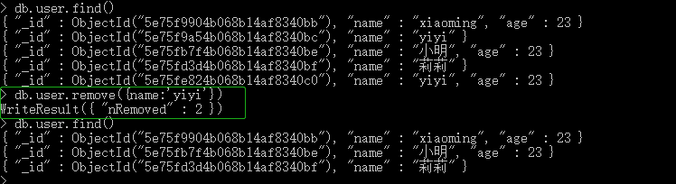

# 008-命令-删除

## 1、根据某些条件删除数据
格式：`db.表名.remove({匹配条件对象})`

比如把user表中`name=yiyi`的数据删除掉，命令`db.user.remove({name:'yiyi'})`，这条命令会有多少条就删多少。

`db.user.remove({})` 该命令会清空整个user表，注意这里remove()是要传递个空json进去

## 2、清空某个表
格式: `db.表名.remove({})`

这里是清空整个表的数，但不会删除表
