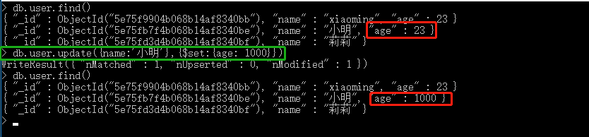
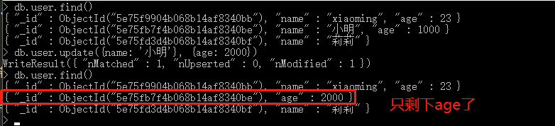

# 009-命令-更新

## 1、更新命令update
格式：`db.表名.update({匹配条件对象}, {$set: {修改后的数据}})`

比如把user表中`name=小明`的age改为1000：`db.user.update({name:'小明'},{$set:{age: 1000}})`

update命令，有带`$set`和无带`$set`不同作用，带`$set`的只会更新被命中的数据，不带`$set`的就会把整条数据都改为传入的数据

> 比如上面命令`db.user.update({name:'小明'},{$set:{age: 1000}})`。会去找`name=小明`的数据，然后把那条数据的`age`改为`1000`，如果`age`不存在就加上这个字段

> 如果不带`$set`，改为`db.user.update({name:'小明'}, {age: 1000})`。则是去找`name=小明`的数据，然后把那条数据的数据都改为`age=1000`。其他数据都干掉了

