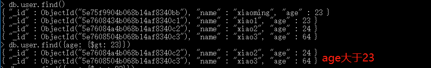
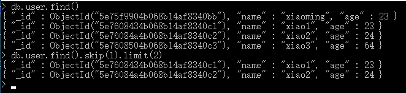
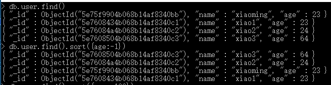
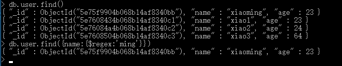
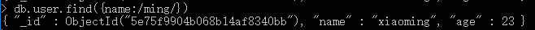
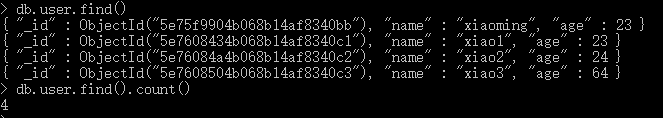

# 010-命令-简单查询


## 1、查看某个数据库有哪些表
比如查看blog这个数据库上面有哪些表
```shell
use blog

show collections
```


## 2、查看某个表的的数据

## 2.1 某个表的所有数据
格式`db.表名.find()`

比如查看user表的所有数据
```shell
db.user.find()
```


### 2.2 根据条件简单查找数据
格式：`db.表名.find(匹配条件)`

比如查看`age=23`的数据：`db.user.find({age:23})`

大于小于等的条件筛选，比如查询age大于23分的用户`db.user.find({age: {$gt: 23}})`



其他类型：

* `$gt` 大于
* `$gte` 大于等于
* `$lt` 小于
* `$lte` 小于等于
* `$or`: 或者。比如`db.users.find({$or: [{name:'小明'}, {name:'嫦娥'}]})`查出`name=小明`或`name=嫦娥`的数据
* `$regex`: 根据正则搜索，一般用于模糊搜索。比如`db.users.find({name: {$regex:/明/i}})`搜索出`name带明`的数据。当然一般关键词是由前端传递过来，所以写法要稍微改下`db.users.find({name: {$regex: new RegExp('明')}})`这样就支持动态正则了。


### 2.3 分页
格式：`db.表名.find().skip(跳过多少条).limit(展示多少条)`

比如查看user表，跳过1条，展示2条：`db.user.find().skip(1).limit(2)`




### 2.4 排序
格式：`db.表名.find().sort({key: 排序方式})`

* 1表示升序
* -1表示降序

比如查看user，按照age升序排序：`db.user.find().sort({age:-1})`




### 2.5 模糊搜索
格式：`db.表名.find({key: { $regex: 关键字 }})`

比如查找user表中name含ming的数据：`db.user.find({name:{$regex:'ming'}})`



实际上，mongodb是支持正则匹配搜索的，直接把条件用正则写即可，上面等价于`db.user.find({ name:/ming/ })`




### 2.6 当前集合的记录数
格式：`db.表名.find().count()`

比如查user表的记录数：`db.user.find().count()`


