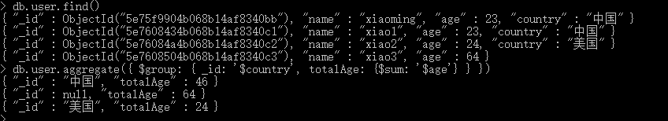
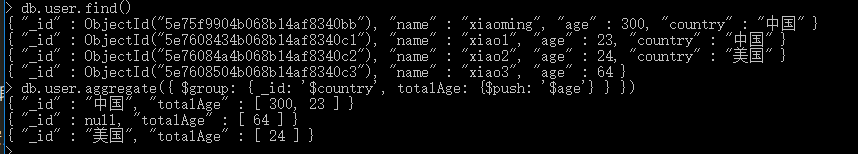
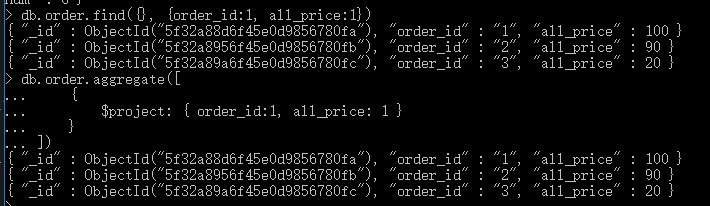
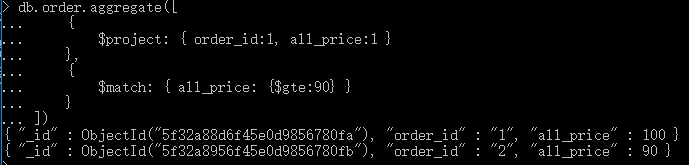
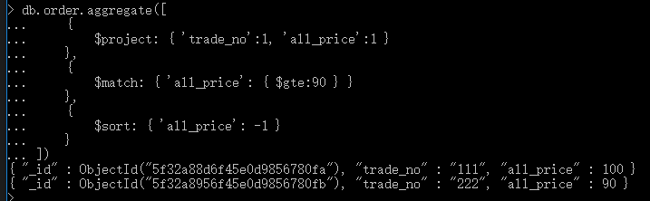

# 011-命令-聚合管道

聚合管道，就是将数据按照某个字段分组，然后再根据某些字段计算

格式: `db.表名.aggregate([{<stage>}, ...])`

## 1、常用的管道操作符

|    mongo    |                  total               |   类似mysql的   |
| ----------- | ------------------------------------ | -------------- |
|  `$project` | 添加、删除、重命名字段                    |  select        |
|  `$match`   | 条件匹配，只满足条件的数据才能进入下一阶段  |  where; having |
|  `$limit`   | 限制结果数量                           |  limit         |
|  `$skip`    | 跳过文档数量                           |                |
|  `$sort`    | 条件排序                              |  order by       |
|  `$group`   | 条件组合结果统计                        |  group by      |
|  `$lookup`  | 用于引入其他表的数据，联表操作            |  join           |
|  `$sum`     | 计算和                                |  sum(); count() |
|  `$unwind`  | 解构数组，当查回数据只有1条的时候，可以用来将数组解构为json |   |


## 2、常用的管道表达式
`{$match:{status:"A"}}`，`$match`称为管道操作符。而`status:"A"`称为管道表达式，是管道操作符的操作数。

而管道表达式是一个文档结构，它是由字段名、字段值、表达式操作符组成的。

|  常用表达式操作符  |        total       |
| --------------- | ------------------- |
| $addToSet       | 将文档指定字段的值去重  |
| $max            | 文档指定字段的最大值   |
| $min            | 文档指定字段的最小值   |
| $sum            | 文档指定字段求和       |
| $avg            | 文档指定字段求平均     |
| $gt             | 大于给定值            |
| $lt             | 小于给定值            |
| $eq             | 等于给定值            |


## 3、$group管道操作符

格式：`db.表名.aggregate({ $group:{ _id: '$根据哪个字段分组',其他展示字段 } })`

比如user表中，按照country字段分组，然后计算每个组age的总和：
```shell
db.user.aggregate({
    $group: {
        _id: '$country',
        totalAge: {$sum: '$age'}
    }
})
```



可以看出，`$group`后面的字段都是查询后展示的。没有country字段的被分为一组。

`_id`不能少，因为必须明确按照哪个字段去分组。

`totalAge: {$sum: '$age'}`的意思是age字段算出总和，然后赋值给totalAge字段

类似的有

* `$sum` 求和
* `$avg` 求平均值
* `$min` 求最小值
* `$max` 求最大值
* `$push` 把结果push到一个数组中

`$push`效果如下：



## 4、$project操作符
比如有下面数据
```shell
// order表
db.order.insert({ order_id: '1', uid: 10, trade_no: '111', all_price: 100, all_num: 2 });
db.order.insert({ order_id: '2', uid: 7, trade_no: '222', all_price: 90, all_num: 2 });

// order_item表
db.order_item.insert({"order_id":"1","title":"商品鼠标1","price":50,num:1})
db.order_item.insert({"order_id":"1","title":"商品键盘2","price":50,num:1})
db.order_item.insert({"order_id":"1","title":"商品键盘3","price":0,num:1})
db.order_item.insert({"order_id":"2","title":"牛奶","price":50,num:1})
db.order_item.insert({"order_id":"2","title":"酸奶","price":40,num:1})
db.order_item.insert({"order_id":"3","title":"矿泉水","price":2,num:5})
db.order_item.insert({"order_id":"3","title":"毛巾","price":10,num:1})
```

查询订单order表，只展示`order_id`和`all_price`2个字段
```shell
// find函数实现
db.order.find({}, {order_id:1, all_price:1})

// aggregate实现
db.order.aggregate([
    {
        $project: { order_id:1, all_price: 1 }
    }
]);
```




## 5、$match操作符
比如有下面数据
```shell
// order表
db.order.insert({ order_id: '1', uid: 10, trade_no: '111', all_price: 100, all_num: 2 });
db.order.insert({ order_id: '2', uid: 7, trade_no: '222', all_price: 90, all_num: 2 });

// order_item表
db.order_item.insert({"order_id":"1","title":"商品鼠标1","price":50,num:1})
db.order_item.insert({"order_id":"1","title":"商品键盘2","price":50,num:1})
db.order_item.insert({"order_id":"1","title":"商品键盘3","price":0,num:1})
db.order_item.insert({"order_id":"2","title":"牛奶","price":50,num:1})
db.order_item.insert({"order_id":"2","title":"酸奶","price":40,num:1})
db.order_item.insert({"order_id":"3","title":"矿泉水","price":2,num:5})
db.order_item.insert({"order_id":"3","title":"毛巾","price":10,num:1})
```
现在过滤数据
```shell
db.order.aggregate([
    {
        $project: { order_id:1, all_price:1 }
    },
    {
        $match: { all_price: {$gte:90} }
    }
]);
```
上面的的代码会进行下面2步的处理:
1. 将order表中数据选出`order_id`和`all_price`2个字段展示
2. 将上面新组合的表中，筛选出`all_price大于等于90`的




## 6、$sort操作符
排序，1(升序) / -1(降序)
```sql
db.order.aggregate([
    {
        $project: { 'trade_no':1, 'all_price':1 }
    },
    {
        $match: { 'all_price': { $gte:90 } }
    },
    {
        $sort: { 'all_price': -1 }
    }
])
```
上面的过程:
1. 只展示`trade_no / all_price`这2列
2. 将步骤1结果筛选出`all_price大于等于90`的
3. 将步骤2结果中按照`all_price降序`排列




## 7、$skip操作符和$limit操作符
用来实现分页的
```sql
db.order.aggregate([
    {
        $limit: 3
    },
    {
        $skip: 1
    }
]);
```