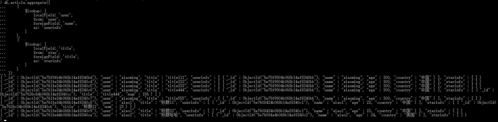

# 012-命令-联合查询

多个表联合查询，是使用聚合函数的`$lookup`实现的。

联表查询格式，通过`表1.字段A = 表2.字段B`关联上2张表然后展示
```shell
db.表名1.aggregate([
    {
        // 在聚合管道中加入一次查找操作
        $lookup: {
            localField: '', // 表名1的字段A
            from: '', // 表名2
            foreignField: '', // 表名2中的字段B
            as: '' // 给表2起个别名展示
        }
    }
])
```

比如有下面的数据
```
> db.article.find()
{ "_id" : ObjectId("5e75f9fb4b068b14af8340bd"), "user" : "xiaoming", "title" : "title111" }
{ "_id" : ObjectId("5e761fe34b068b14af8340c4"), "user" : "xiaoming", "title" : "title222" }
{ "_id" : ObjectId("5e761fe34b068b14af8340c5"), "user" : "xiaoming", "title" : "title333" }
{ "_id" : ObjectId("5e761fe34b068b14af8340c6"), "user" : "xiaoming", "title" : "title444" }
{ "_id" : ObjectId("5e761fe34b068b14af8340c7"), "user" : "xiaoming", "title" : "title555" }
{ "_id" : ObjectId("5e761fe34b068b14af8340c8"), "user" : "xiao1", "title" : "标题11" }
{ "_id" : ObjectId("5e761fe34b068b14af8340c9"), "user" : "xiao1", "title" : "标题22" }
{ "_id" : ObjectId("5e761fe44b068b14af8340ca"), "user" : "xiao2", "title" : "标题哈哈" }

> db.user.find()
{ "_id" : ObjectId("5e75f9904b068b14af8340bb"), "name" : "xiaoming", "age" : 300, "country" : "中国" }
{ "_id" : ObjectId("5e7608434b068b14af8340c1"), "name" : "xiao1", "age" : 23, "country" : "中国" }
{ "_id" : ObjectId("5e76084a4b068b14af8340c2"), "name" : "xiao2", "age" : 24, "country" : "美国" }
{ "_id" : ObjectId("5e7608504b068b14af8340c3"), "name" : "xiao3", "age" : 64 }
```
查询文章article表和用户user表联合数据，维度文章下面有个userinfo字段，这个字段展示用户信息。执行命令：
```
db.article.aggregate([
    {
        $lookup: {
            localField: 'user',
            from: 'user',
            foreignField: 'name',
            as: 'userinfo'
        }
    }
])
```

上面代码意思：通过`article.user = user.name`关联起来，然后user表起个别名userinfo展示

多个表查询只需要继续加`$lookup`：
```
db.article.aggregate([
    {
        $lookup: {
            localField: 'user',
            from: 'user',
            foreignField: 'name',
            as: 'userinfo'
        }
    },
    {
        $lookup: {
            ...
        }
    }

])
```
比如有文章点赞表：
```
{ "_id" : ObjectId("5e7626c24b068b14af8340cb"), "title" : "标题11", "num" : 23 }
{ "_id" : ObjectId("5e7626c64b068b14af8340cc"), "title" : "title444", "num" : 156 }
```

通过`article.user = user.name`关联文章-用户表，并且通过`article.title = star.title`关联文章-点赞表。
```
db.article.aggregate([
    {
        $lookup: {
            localField: 'user',
            from: 'user',
            foreignField: 'name',
            as: 'userinfo'
        }
    },
    {
        $lookup: {
            localField: 'title',
            from: 'star',
            foreignField: 'title',
            as: 'starinfo'
        }
    }
])
```


