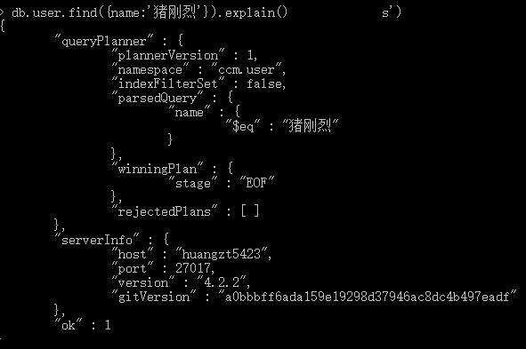
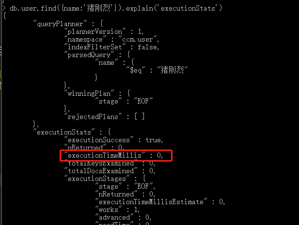

# 013-命令-索引

## 1、索引的相关命令
### 1.1 设置索引
命令: `db.users.ensureIndex({name:1})` 把users表中的name字段设置为索引

> 数字 1-表示`name`键的索引按升序存储， -1-表示`age`键的索引按照降序方式存储


### 1.2 获取索引
命令: `db.users.getIndexes()` 查看users表中的索引


### 1.3  删除索引
命令: `db.users.dropIndex({name:1})` 把user表中name索引删除


## 2、复合索引
比如`db.users.ensureIndex({"username":1, "age":-1})`将username和age这2个字段建立索引，由多个字段组合而成的称为复合索引，复合索引其实也是一个索引

在执行`db.users.find({age:30, name:'stephen'})` 或 `db.users.find({name: 'stephen'})` 的时候索引才会起作用，而执行 `db.users.find({age:30})` 的时候并不起作用。

如果想用到复合索引， 必须在查询条件中包含复合索引中的前 N 个索引列。


## 3、唯一索引
默认情况下，建立的索引并没有要求值唯一，如果想要加唯一性，需要传入第2个参数
```shell
db.users.ensureIndex({name:1}, {unique:true})
```
这样子，该索引就是唯一索引，当值出现错误，就不给插入更新等等。

如果插入的数据name字段是空的，则会默认null，但也只能出现一条数据是null，再插入一条name为空的数据就不允许了


对于复合索引，也可以建立唯一索引
```sql
db.users.ensureIndex({name:1, age:-1}, {unique:true})
```
上面的唯一索引是建立在`name+age`联合上，就是说`name+age`组合在一起唯一就可以

> 索引的其他参数配置，即第2个参数支持的配置

|  参数   | 类型  |  类型  |
|  ----  | ----  |  |
| background  | Boolean | 默认false，建索引过程会阻塞其他数据库操作，true则以后台方式创建索引，但这样创建效率就低 |
| unique  | Boolean | 默认false，建立的索引是否唯一 |
| name  | string | 索引的名称，如果未指定，mongo会自动根据字段名和排序顺序起一个 |
| dropDups  | Boolean | 默认false，在建立唯一索引时是否删除重复记录， |


## 4、explain
eplain返回查询使用的索引情况、耗时、扫描文档数等统计数
```shell
db.user.find({name:'猪刚烈'}).explain()
```
返回结果如图




查看耗时:
```shell
db.user.find({name:'猪刚烈'}).explain('executionStats')
```


关注结果中的`executionStats.executionTimeMillis`字段
