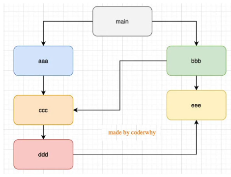

# 002-export和require

## 2、require
* 在第1次引入的时候，js就会执行1次
* 模块多次被导入，会缓存，最终只加载运行1次
> 为什么运行1次？node内部原理是加载运行一次后，会将其那个js标记为`module.loaded=true`。后面发现这个为true就不会再运行
* 如果有循环引入，那么加载顺序是什么样的？

在node中，循环依赖是没有问题的，像上面的加载顺序是`main - aaa  - ccc - ddd - eee - bbb`

node加载模块其实是一种图数据结构，图结构遍历的时候有2种算法: 深度优先搜索、广度优先搜索。Node采用的深度优先搜索

## 3、commonJs规范
* node是通过`exports+require`加载js，并且是同步进行的，因为node本身是做服务器的，这个在服务器上没什么问题，因为都是本地代码，加载速度极快
* 同步意味着只有对应模块加载完毕，才会往下执行

