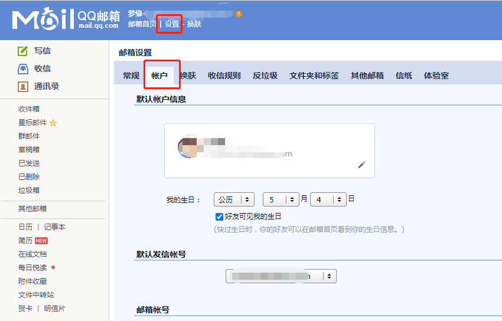
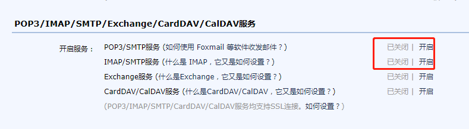
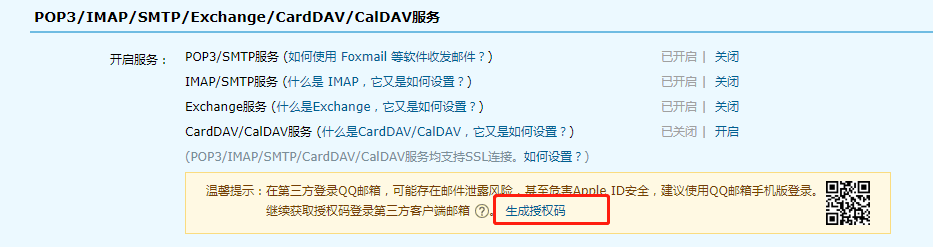

100-发送邮件

通过node发送邮件，可以借用第三方库`nodemailer`

比如借助QQ邮箱，向`test@163.com`发送邮件


1. 安装
```shell
npm i -S nodemailer
```


2. 开通我们的QQ邮箱smtp服务，并生成授权码，这里假如生成的授权码是`shouquanma`








3. 在node中编写代码
```js
const nodemailer = require('nodemailer');


const config = {
    myEmail: '23***32@qq.com',// 那个用来生成授权码的我们自己的邮箱
    pass: 'shouquanma' // 上面生成的授权码
}
const smtp = nodemailer.createTransport({
    service: 'qq',
    auth: {
        user: config.myEmail,
        pass: config.pass
    }
});

const mailOptions = {
    from: `"认证邮件" <${config.user}>`,
    to: 'test@163.com', // 对方的邮箱
    subject: '我是标题',
    html: `我是内容`
};
sendMail(mailOptions, (error, info) => {
    console.log('发送邮箱', error, info);
});
``` 