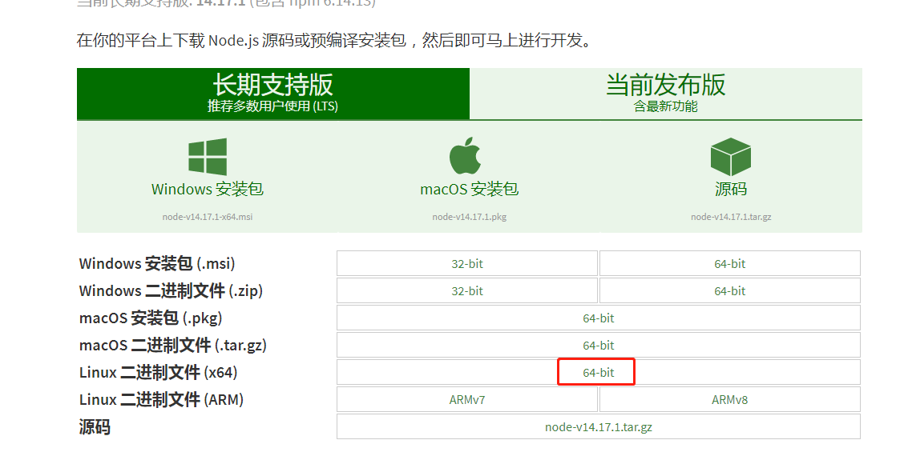
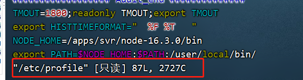
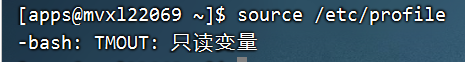
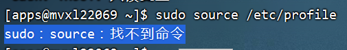
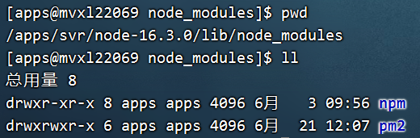
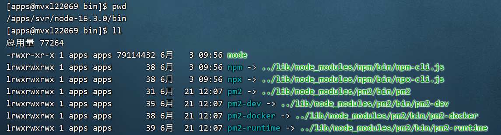

# 001-公司启动node服务过程

在公司，服务器的账号并非root账号，启动过程中遇到过一些问题，记录一下

## 1、安装node

### 1.1 下载解压
服务器无法连接外网，所以需要自己在window上下载好，然后通过ftp工具上传



然后在服务器上进行解压
```shell
tar -xvf node-v16.3.0-linux-x64.tar
```
得到了一个文件夹`node-v16.3.0-linux-x64`，复制并重命名到自己想要的目录`/apps/svr/node-16.3.0`

进入`/apps/svr/node-16.3.0/bin`，可以看到平时常用的`node/npm/npx`命令


### 1.2 设置命令到全局环境
设置的方式有2种，一种是通过建立软连接的方式，一种是通过配置linux全部环境变量的方式（推荐使用这一种）

因为如果是用建立软连接的方式，后面通过`npm i -g`安装全局命令的时候，还需要把安装的又一次建立软连接

```shell
vim /etc/profile
```
因为是apps账号，没有权限，提示下面的



所以使用下面命令
```shell
sudo vim /ect/profile
```

当然这个sudo需要找下运维授权或给下密码

`/ect/profile`新增内容如下，大致上就是把`/apps/svr/node-16.3.0/bin`路径设置到环境变量里面
```
NODE_HOME=/apps/svr/node-16.3.0/bin
export PATH=$NODE_HOME:$PATH:/user/local/bin/
```

重启环境变量
```shell
source /etc/profile
```
提示`-bash: TMOUT: 只读变量`这个又是权限不够



就想到了加个sudo，执行`sudo source /etc/profile`提示`sudo：source：找不到命令`



查了一圈，发现用下面的2条命令即可
```shell
sudo -s
source /etc/profile
```
重启完成后，就可以全局使用node命令了（注意重启后，只有当前窗口或者新窗口才生效，在重启之前已经打开的窗口是不会生效的，这个卡了很久）


## 2、安装pm2
通过
```shell
npm i -g pm2
```

安装完后一直提示`-bash: pm2: 未找到命令`

通过执行
```shell
npm config get prefix
```
得到全局安装的目录`/apps/svr/node-16.3.0`（注意win是该目录下的`node_module`，linux是该目录下的`lib/node_module`）

在`/apps/svr/node-16.3.0/lib/node_modules`，可以看得见已经有pm2的包了



在`/apps/svr/node-16.3.0/bin`里面也可以看到快捷方式



后面才知道就是因为一直用软连接的方式去配置node全局命令，而这次新增了pm2没有创建软连接，这也是推荐用修改`/ect/profile`的方式配置node的原因

重新配置全局环境变量，配置完后，全局命令中可以执行`pm2 list`了

而执行`pm2 start app.js`的时候，一直提示`Cannot find module /apps/svr/我的项目名称/node_module/pm2/lib/ProcessContainerFork.js`

从提示看，pm2启动的时候又是去项目的node_module里面找了，而不是去我们配置的全局命令里面找

这是因为pm2环境发生变化，需要执行下面的命令删除对应的目录

```shell
rm -rf ~/.pm2
```

再执行`pm2 start app.js`可以了


