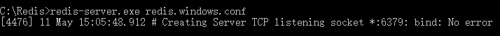
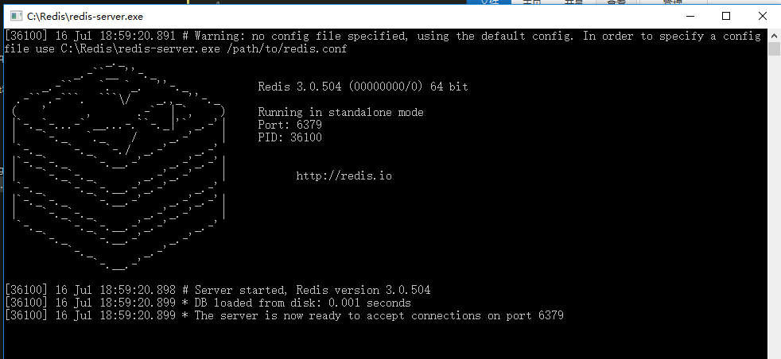
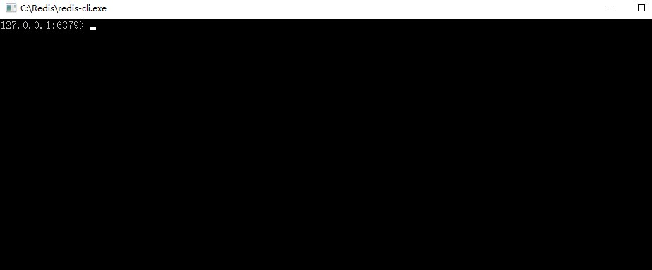
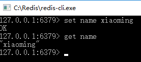

# 001-在window的安装

## 1、安装

这里介绍的是window上redis的安装

1. 下载

从[github](https://github.com/microsoftarchive/redis/releases)下载对应的版本


2. 运行msi

待下载后运行msi，中途会让我们设置安装路径、端口、最大容量等数据。


3. 启动服务端

管理员运行cmd，进入安装好的路径里面`C:\Redis`。执行
```shell
redis-server.exe redis.windows.conf
```




4. 验证
另起一个cmd，执行
```shell
redis-cli.exe -h 127.0.0.1 -p 6379
```
启动客户端，执行
```shell
# 设置
set myKey abc

# 读取
get myKey
```


# 2、redis的几个文件
主要的文件有下面3个:
* `redis.windows.conf`: 客户端的配置
* `redis.windows-service.conf`: 服务端的配置
* `redis-server.exe`: 启动redis服务端
* `redis-cli.exe`: 启动redis客户端

双击`redis-server.exe`启动服务端后



可以再双击`redis-cli.exe`启动客户端，这样客户端就可以连接上服务端了



在客户端可以执行redis的命令

